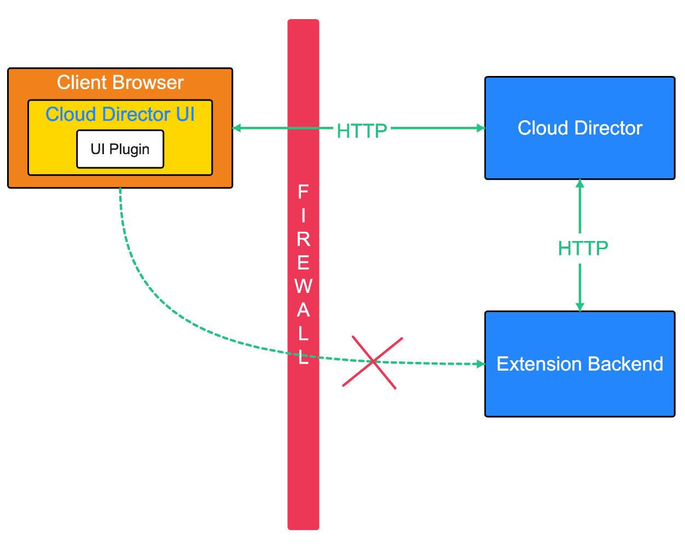
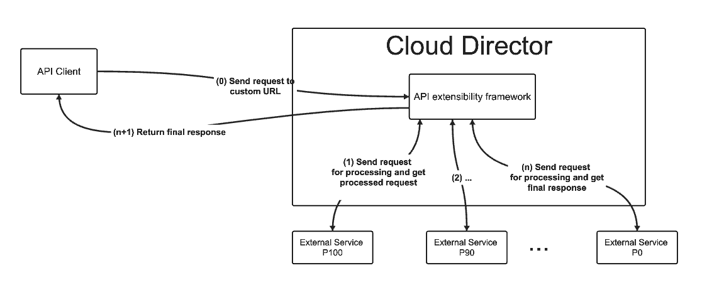
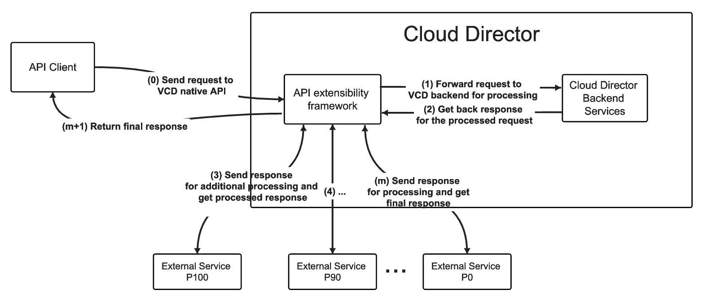

# API extensibility
The API extensibility framework gives providers the ability to extend the standard API included with Cloud Director through a set of well established rules that allow the registration of external systems with the platform and the association of those systems with URLs which are serviced by Cloud Director. Requests made to such URLs are routed to the corresponding external system (API extension) for processing. What is more, the API extensibility framework also allows to configure additional processing of responses with a specific content type by an external system.

Being able to extend the standard Cloud Director API opens up a lot of use cases for extension authors. The main one is making it possible for a client to access an extension (through Cloud Director) even if it is located behind a firewall. What is more, Cloud Director can act as an identity provider for extensions via the API extensibility via HTTP (transparent proxy).



We currently have two flavours of API extensibility:

- [API extensibility via MQTT](#api-extensibility-via-mqtt)
- [API extensibility via HTTP](#api-extensibility-via-http)

Each is suitable for different use cases depending on what the extension requirements are. If simplicity is what is important, the API extensibility via HTTP/Transparent proxy is the way to go. It is suitable for integrating Cloud Director with third party products by providing easy relay to the product's API/UI. However, tenancy integration may be needed in the third-party product. If high performance is key, the API extensibility via MQTT is more suitable. It allows for fast execution but requires having a MQTT extension processing HTTP requests.

The two main concepts in the API extensibility framework are the [External System](#external-system) and the [API filter](#api-filter).

***External System*** = where requests go for processing

***API Filter*** = a rule for which requests go where

## External System
The external system represents an external to Cloud Director system which processes API extensibility requests by communicating with Cloud Director either via MQTT or HTTP. External system is the broader term. It encapsulates the more specific terms - [External Service](#external-service) (API extensibility via MQTT) and [External Endpoint](#external-endpoint) (API extensibility via HTTP).

```
External System = { External Service, External Endpoint }
```

## API Filter
API filters allow external systems (external services and external endpoints) to extend the standard API included with Cloud Director with custom URLs or custom processing of request's responses.

The API filter entity has the following definition:
```json
{
    "externalSystem": {
        "id": "urn:vcloud:extension-api:vmware:test:1.0.0",
        "name": "test"
    },
    "urlMatcher": {
        "urlPattern": "/test/.*",
        "urlScope": "API"
    },
    "responseContentType": null

}
```
- externalSystem - an entity reference to an external endpoint (external service or external endpoint)
- urlMatcher - used to set a custom URL which when requested, will be processed by the external system. More details [here](#the-urlmatcher).
- responseContentType - response Content-Type, expressed as a MIME Content-Type string. Responses whose Content-Type attribute has a value that matches this string are routed to this external service. `responseContentType` is mutually exclusive with `urlPattern`. The `responseContentType` property is __only__ applicable for external services.

### The urlMatcher

The `urlMatcher` consists of `urlPattern` and `urlScope` which together identify a URL which will be serviced by an external system. The `urlMatcher` holds different information when working with extenral services and external endpoints.

#### External Services and the urlMatcher
In the case of external services, the `urlMatcher` will match requests under `/api`.

Only allowed value for `urlScope` is `API`.

The `urlPattern` holds the request URL pattern, written as a regular expression pattern. Element content cannot exceed 1024 characters.

Example `urlMatcher`:
```json
{
    "urlPattern": "/api/org/.*/currentTime",
    "urlScope": "API"
}
```
The above `urlMatcher` will match the following URLs:

- `/api/org/testOrg/currentTime`
- `/api/org/urn:vcloud:org:5eac4ea6-11e4-4827-a249-ac8631779b92/currentTime`
- `/api/org/testOrg/testing/currentTime`

#### External Endpoints and the urlMatcher

In the case of external endpoints, the `urlMatcher` will match requests under the extensibility API endpoints:
- `/ext-api`
- `/ext-ui/provider`
- `/ext-ui/tenant/<tenant-name>`

The allowed values for `urlScope` are `EXT_API`, `EXT_UI_PROVIDER`, `EXT_UI_TENANT` corresponding to `/ext-api`, `/ext-ui/provider`, `/ext-ui/tenant/<tenant-name>`.

The `urlPattern` is a regular expression pattern. Element content cannot exceed 1024 characters. The urlPattern must end with `.*` which specifies that the part of the URL coming after will be redirected to an external endpoint.

Example `urlMatcher`:
```json
{
    "urlPattern": "/custom/.*",
    "urlScope": "EXT_API"
}
```

With the above `urlMatcher`:

- `/ext-api/custom/createObject` will be redirected to `<ext-endpoint-root-url>/createObject`
- `/ext-api/custom/get/123` will be redirected to `<ext-endpoint-root-url>/get/123`
- `/ext-api/custom/` will be redirected to `<ext-endpoint-root-url>`

It is important to note that in the case of `TENANT` urlScope, the tenant name is not part of the `urlPattern`. The `urlPattern` will match the request after the tenant name.

For example if we have the following `urlMatcher`:
```json
{
    "urlPattern": "/custom/test/.*",
    "urlScope": "EXT_UI_TENANT"
}
```

The following URLs will be matched by this `urlMatcher`:

- `/ext-ui/tenant/testOrg/custom/test/createObject` will be redirected to `<ext-endpoint-root-url>/createObject`
- `/ext-ui/tenant/simpleOrg/custom/test/` will be redirected to `<ext-endpoint-root-url>`

## API extensibility via MQTT

### Overview
As the name suggests, the API extensibility via MQTT framework allows providers to extend the Cloud Director standard API with API extensions which use __MQTT__ as a form of communication with Cloud Director. We call such external systems (API extensions) which communicate with Cloud Director over MQTT __external services__.

The two approaches we have for "extending the Cloud Director standard API" with custom request processing by an external service are:
- [Register a __custom URL__](#registering-custom-urls-to-be-serviced-by-the-external-service) to be serviced by an external service. All requests made to this URL will be routed to the external service for processing and the response will be propagated back to the caller.


- [Register a __response content type__](#custom-processing-of-specific-response-content-types) for processing by an external service. All requests made to Cloud Director which result in a response with the specific content type will be routed to the external service for further processing before the response being returned back to the caller.



In regards to custom processing of requests, the external service can:
- modify the initial API request received by Cloud Director from the client
- modify the response to an API request returned by Cloud Director
- generate a completely new response message for the request, and return it to the client via Cloud Director

### Get started

We will get started with a simple example and build on top of it while going through the specifics of API extensibility via MQTT.

Let us go through the main concepts first:

- [External Service](#external-service)
- [API filter](#api-filter)
- [API Definition](#api-definition)
- [Link](#link)
- [Right](#right)
- [Resource Class](#resource-class)

If instead you wish to start with a basic example and build on top of it, skip to [here](#building-an-api-extension-via-mqtt).

### External Service
Any external to Cloud Director system which needs to be able to process custom API requests via MQTT needs to be registered as an __external service__ in Cloud Director.

The external service entity has the following definition:
```json
{
    "id": "urn:vcloud:extension-api:testVendor:testName:1.0.0",
    "name": "testName",
    "version": "1.0.0",
    "vendor": "testVendor",
    "description": "test description",
    "enabled": true,
    "priority": 100,
    "authorizationEnabled": false,
    "mqttTopics": {
        "monitor": "topic/extension/testVendor/testName/1.0.0/ext",
        "respond": "topic/extension/testVendor/testName/1.0.0/vcd"
    }
}
```

The vendor, name and version trio is unique for each external service.

- `enabled` - true/false (a user provided field) - whether the external service is enabled or not. If the external service is not enabled, requests will not be routed to it for processing. Cloud Director acts as if the service does not exist.
- `priority` - 0-100 (a user provided field) - what is the priority of the external service when processing requests. More information on priority of external services can be found [here](#priority-of-external-services).
- `authorizationEnabled` - true/false (a user provided field) - whether authorization is enabled for the service. More information on what authorization of external service entails can be found [here](#authorization-of-external-services).
- `mqttTopics` - (generated by Cloud Director per external service) - contains the MQTT topics which the external service will use to communicate with Cloud Director - the `monitor` topic is the one the external service will receive messages from Cloud Director on, and the `respond` topic is the one the external service will use to send responses.

#### Priority of external services
More than one external service can be configured to process the same requests. If there are multiple external services processing the same request, the external services are chained. The priority field is used to set what priority an external service will have when processing requests. 100 is the most priority, 0 is the least priority.

#### Authorization of external services

1. __Overview__

    The `authorizationEnabled` flag in the external service definition, as the name suggests, sets whether authorization is enabled for the service.

    If authorization is enabled, there is a mechanism of Actions, ACL Rules and optionally Rights to configure which users can access custom URLs of external services. The access control of custom URLs is based on the user access to some Cloud Director resource (can be external or a core Cloud Director entity).

    There are some prerequisites to make authorization work: [ResourceClasses](#resource-class), [ResourceClassActions](#resource-class-action), [AclRules](#acl-rule) and optionally [ServiceResources](#service-resource) have to be created in Cloud Director.
    If service authorization is enabled and there isn't any of the mentioned entities created, each call to this service's URL/URLs will be always rejected as not authorized.

    A __Resource Class__ entity represents an external entity type defined for an external service. More information can be found [here](#resource-class).

    A __Resource Class Action__ represents an operation on a Resource Class. More information can be found [here](#resource-class-action).

    An __Acl Rule__ is a condition which, if met, grants permissions. More information can be found [here](#acl-rule).

    And a __Service Resource__ represents a resource/entity/service exposed by a service. Each Service Resource is registered for only one Resource Class that defines the type of this resource. More information can be found [here](#service-resource).

2. __Authorization mechanism explained__

    When a request is made to a custom URL, all external services which are enabled to process requests on this URL are found. All of these services are authorized first before letting them process the request. One service can have authorization enabled and another service can have authorization disabled. If authorization fails for one of the services, then the whole request is rejected and status code 403 (Access Denied) is returned.

    But what does authorizing a service mean in this context? Authorizing a service means that upon making a request, the user will be verified against the request URI, request method and request content type based on the defined authorization rules (Resource Class Actions and ACL Rules).

    The authorization rules are defined in the context of a Resource Class. As previously said, the Resource Class represents an external resource type in Cloud Director ([more info](#resource-class)). The mime type in the Resource Class is used in the authorization process to find the actual resource in Cloud Director, against which the authorization process will run. This resource can be both a Cloud Director core entity or an external to Cloud Director entity - so the mime type can be set to something external to Cloud Director (e.g. `Backup+xml`) or an internal Cloud Director entity type (e.g. `application/vnd.vmware.admin.organization+xml`).

    Resource Class Actions ([more info](#resource-class-action)) are created as part of the resource class. They define which HTTP methods are allowed for a custom URL (URLs).

    Each Resource Class Action contains a list of ACL Rules ([more info](#acl-rule)). ACL Rules hold the actual rules for which user/org/right has access to a resource (external resource or Cloud Director core resource).

    So in order to configure external service authorization, you need to defined at least one Resource, one Resource Class Action and one ACL Rule.

### Link
A `Link` is a Cloud Director entity which allows extension authors to configure links to external services to be returned as part of the response of native Cloud Director APIs - i.e. returning a link to an external service in the response of `GET /api/org/<org-id>`.
In order to find the link for creating a `Link` for an external service, you need to perform a GET on the external service and the link will be part of the response.

```
GET /cloudapi/extensions/api/<externa-service-id>
```
Response:
```json
Headers:
...
Link: <https://localhost:8443/api/admin/extension/service/4c1dec82-5502-33fe-9787-0402b70e0454/links>;rel="down";type="application/vnd.vmware.vcloud.query.records+xml application/vnd.vmware.vcloud.query.idrecords+xml application/vnd.vmware.vcloud.query.records+json application/vnd.vmware.vcloud.query.idrecords+json application/vnd.vmware.vcloud.query.references+xml application/vnd.vmware.vcloud.query.references+json"
...

Body:
{
    "name": "test",
    "id": "urn:vcloud:extension-api:vmware:test:1.0.0",
    "version": "1.0.0",
    "vendor": "vmware",
    "priority": 100,
    "enabled": true,
    "authorizationEnabled": false,
    "description": null,
    "mqttTopics": {
        "monitor": "topic/extension/vmware/test/1.0.0/ext",
        "respond": "topic/extension/vmware/test/1.0.0/vcd"
    }
}
```
The link for creating a service `Link` is in the response headers.
Let's say we have an external service registered and an API filter with the following urlPattern - `/api/org/.*/currentTime`. If we want a link to this custom URL to be returned each time a GET is executed on an organization, we must create a `Link`:

Creating a link is done with the following API call:
```
POST /api/admin/extension/service/4c1dec82-5502-33fe-9787-0402b70e0454/links

Headers:
Content-Type: application/vnd.vmware.admin.serviceLink+xml;version=38.0
```
```xml
<?xml version="1.0" encoding="UTF-8" standalone="yes"?>
<ns2:ServiceLink xmlns="http://www.vmware.com/vcloud/v1.5"
        xmlns:ns2="http://www.vmware.com/vcloud/extension/v1.5"
        xmlns:ns3="http://schemas.dmtf.org/wbem/wscim/1/cim-schema/2/CIM_ResourceAllocationSettingData"
        xmlns:ns4="http://schemas.dmtf.org/ovf/envelope/1"
        xmlns:ns5="http://schemas.dmtf.org/wbem/wscim/1/cim-schema/2/CIM_VirtualSystemSettingData"
        xmlns:ns6="http://schemas.dmtf.org/wbem/wscim/1/common"
        xmlns:ns7="http://www.vmware.com/schema/ovf"
        xmlns:ns8="http://schemas.dmtf.org/ovf/environment/1"
        xmlns:ns9="http://www.vmware.com/vcloud/versions">

    <ns2:LinkHref>{baseUri}org/{resourceId}/currentTime</ns2:LinkHref>
    <ns2:MimeType>text/plain</ns2:MimeType>
    <ns2:Rel>down:currentTime</ns2:Rel>
    <ns2:ResourceType>application/vnd.vmware.vcloud.org+xml</ns2:ResourceType>
</ns2:ServiceLink>
```
Response:
```xml
<?xml version="1.0" encoding="UTF-8" standalone="yes"?>
<vmext:ServiceLink xmlns="http://www.vmware.com/vcloud/v1.5" xmlns:vmext="http://www.vmware.com/vcloud/extension/v1.5" xmlns:rasd="http://schemas.dmtf.org/wbem/wscim/1/cim-schema/2/CIM_ResourceAllocationSettingData" xmlns:ovf="http://schemas.dmtf.org/ovf/envelope/1" xmlns:common="http://schemas.dmtf.org/wbem/wscim/1/common" xmlns:vssd="http://schemas.dmtf.org/wbem/wscim/1/cim-schema/2/CIM_VirtualSystemSettingData" xmlns:vmw="http://www.vmware.com/schema/ovf" xmlns:ovfenv="http://schemas.dmtf.org/ovf/environment/1" xmlns:ns9="http://www.vmware.com/vcloud/versions" id="urn:vcloud:serviceLink:eb12aa7e-a63b-4f3d-90e4-8469f8e2f175" href="https://localhost:8443/api/admin/extension/service/link/eb12aa7e-a63b-4f3d-90e4-8469f8e2f175" type="application/vnd.vmware.admin.serviceLink+xml">
    <Link rel="remove" href="https://localhost:8443/api/admin/extension/service/link/eb12aa7e-a63b-4f3d-90e4-8469f8e2f175"/>
    <Link rel="up" href="https://localhost:8443/api/admin/extension/service/4c1dec82-5502-33fe-9787-0402b70e0454" type="application/vnd.vmware.admin.service+xml" name="test"/>
    <Link rel="up" href="https://localhost:8443/api/admin/extension/service/4c1dec82-5502-33fe-9787-0402b70e0454" type="application/vnd.vmware.admin.service+json" name="test"/>
    <vmext:LinkHref>{baseUri}org/currentTime</vmext:LinkHref>
    <vmext:MimeType>text/plain</vmext:MimeType>
    <vmext:Rel>down:currentTime</vmext:Rel>
    <vmext:ResourceType>application/vnd.vmware.vcloud.org+xml</vmext:ResourceType>
</vmext:ServiceLink>
```
Now that we have created this `Link`, we can see that it is returned when GET-ing an organization:

```
GET /api/org/<orgId>
```

Response:
```xml
<?xml version="1.0" encoding="UTF-8" standalone="yes"?>
<Org xmlns="http://www.vmware.com/vcloud/v1.5" xmlns:rasd="http://schemas.dmtf.org/wbem/wscim/1/cim-schema/2/CIM_ResourceAllocationSettingData" xmlns:ovf="http://schemas.dmtf.org/ovf/envelope/1" xmlns:vssd="http://schemas.dmtf.org/wbem/wscim/1/cim-schema/2/CIM_VirtualSystemSettingData" xmlns:common="http://schemas.dmtf.org/wbem/wscim/1/common" xmlns:vmw="http://www.vmware.com/schema/ovf" xmlns:vmext="http://www.vmware.com/vcloud/extension/v1.5" xmlns:ovfenv="http://schemas.dmtf.org/ovf/environment/1" xmlns:ns9="http://www.vmware.com/vcloud/versions" name="STFTestOrg" id="urn:vcloud:org:5eac4ea6-11e4-4827-a249-ac8631779b92" href="https://localhost:8443/api/org/5eac4ea6-11e4-4827-a249-ac8631779b92" type="application/vnd.vmware.vcloud.org+xml">
    <Link rel="down" href="https://localhost:8443/api/query?type=adminOrgVdc&amp;filter=org%3D%3D5eac4ea6-11e4-4827-a249-ac8631779b92" type="application/vnd.vmware.vcloud.query.records+xml"/>
    <Link rel="down" href="https://localhost:8443/api/query?type=adminOrgVdc&amp;filter=org%3D%3D5eac4ea6-11e4-4827-a249-ac8631779b92" type="application/vnd.vmware.vcloud.query.records+json"/>
    <Link rel="down" href="https://localhost:8443/api/tasksList/5eac4ea6-11e4-4827-a249-ac8631779b92" type="application/vnd.vmware.vcloud.tasksList+xml"/>
    <Link rel="down" href="https://localhost:8443/api/tasksList/5eac4ea6-11e4-4827-a249-ac8631779b92" type="application/vnd.vmware.vcloud.tasksList+json"/>
    <Link rel="add" href="https://localhost:8443/api/admin/org/5eac4ea6-11e4-4827-a249-ac8631779b92/catalogs" type="application/vnd.vmware.admin.catalog+xml"/>
    <Link rel="add" href="https://localhost:8443/api/admin/org/5eac4ea6-11e4-4827-a249-ac8631779b92/catalogs" type="application/vnd.vmware.admin.catalog+json"/>
    <Link rel="down" href="https://localhost:8443/api/query?type=adminCatalog&amp;filter=org%3D%3D5eac4ea6-11e4-4827-a249-ac8631779b92,isShared%3D%3Dtrue" type="application/vnd.vmware.vcloud.query.records+xml"/>
    <Link rel="down" href="https://localhost:8443/api/query?type=adminCatalog&amp;filter=org%3D%3D5eac4ea6-11e4-4827-a249-ac8631779b92,isShared%3D%3Dtrue" type="application/vnd.vmware.vcloud.query.records+json"/>
    <Link rel="down" href="https://localhost:8443/api/supportedSystemsInfo/" type="application/vnd.vmware.vcloud.supportedSystemsInfo+xml"/>
    <Link rel="down" href="https://localhost:8443/api/supportedSystemsInfo/" type="application/vnd.vmware.vcloud.supportedSystemsInfo+json"/>
    <Link model="Tokens" rel="down" href="https://localhost:8443/cloudapi/1.0.0/tokens" type="application/json"/>
    <Link rel="down" href="https://localhost:8443/api/org/5eac4ea6-11e4-4827-a249-ac8631779b92/hybrid" type="application/vnd.vmware.vcloud.hybridOrg+xml"/>
    <Link rel="down" href="https://localhost:8443/api/org/5eac4ea6-11e4-4827-a249-ac8631779b92/hybrid" type="application/vnd.vmware.vcloud.hybridOrg+json"/>
    <Link rel="instantiate" href="https://localhost:8443/api/org/5eac4ea6-11e4-4827-a249-ac8631779b92/action/instantiate" type="application/vnd.vmware.vcloud.instantiateVdcTemplateParams+xml"/>
    <Link rel="instantiate" href="https://localhost:8443/api/org/5eac4ea6-11e4-4827-a249-ac8631779b92/action/instantiate" type="application/vnd.vmware.vcloud.instantiateVdcTemplateParams+json"/>
    <Link rel="networkZones" href="https://localhost:8443/cloudapi/1.0.0/vdcGroups" type="application/json"/>
    <Link rel="rollup" href="https://localhost:8443/api/org/5eac4ea6-11e4-4827-a249-ac8631779b92/vdcRollup" type="application/vnd.vmware.vcloud.orgVdcRollup+xml"/>
    <Link rel="rollup" href="https://localhost:8443/api/org/5eac4ea6-11e4-4827-a249-ac8631779b92/vdcRollup" type="application/vnd.vmware.vcloud.orgVdcRollup+json"/>
    <Link rel="down" href="https://localhost:8443/cloudapi/1.0.0/orgs/urn:vcloud:org:5eac4ea6-11e4-4827-a249-ac8631779b92/quotas" type="application/json"/>
    <Link rel="edit" href="https://localhost:8443/cloudapi/1.0.0/orgs/urn:vcloud:org:5eac4ea6-11e4-4827-a249-ac8631779b92/quotas" type="application/json"/>
    <Link rel="edit" href="https://localhost:8443/cloudapi/1.0.0/orgs/urn:vcloud:org:5eac4ea6-11e4-4827-a249-ac8631779b92/quotaPolicy" type="application/json"/>
    <Link rel="down" href="https://localhost:8443/cloudapi/1.0.0/orgs/urn:vcloud:org:5eac4ea6-11e4-4827-a249-ac8631779b92/quotaPolicy" type="application/json"/>
    <Link rel="down" href="https://localhost:8443/api/org/5eac4ea6-11e4-4827-a249-ac8631779b92/metadata" type="application/vnd.vmware.vcloud.metadata+xml"/>
    <Link rel="down" href="https://localhost:8443/api/org/5eac4ea6-11e4-4827-a249-ac8631779b92/metadata" type="application/vnd.vmware.vcloud.metadata+json"/>
    <Link rel="alternate" href="https://localhost:8443/api/admin/org/5eac4ea6-11e4-4827-a249-ac8631779b92" name="application/vnd.vmware.admin.organization+xml" type="application/vnd.vmware.admin.organization+xml"/>
    <Link rel="alternate" href="https://localhost:8443/api/admin/org/5eac4ea6-11e4-4827-a249-ac8631779b92" name="application/vnd.vmware.admin.organization+xml" type="application/vnd.vmware.admin.organization+json"/>

    <Link rel="down:currentTime" href="https://localhost:8443/api/org/5eac4ea6-11e4-4827-a249-ac8631779b92/currentTime" type="text/plain"/>

    <Description>Test organization</Description>
    <FullName>Test Org 1</FullName>
</Org>
```
We can see the newly created custom link is part of the response:
```xml
<Link rel="down:currentTime" href="https://localhost:8443/api/org/5eac4ea6-11e4-4827-a249-ac8631779b92/currentTime" type="text/plain"/>
```

### Resource Class

A Resource Class entity represents an external entity type defined for an external service. Resource Classes are used by Cloud Director to find the URL to the entity's representation based on the entity's URN.

Part of the responsibility of the external services' authors is to supply the necessary information in the Resource Class definition for the functionality to work properly. Necessary information includes mime type, url template, nid and urn pattern. These properties should be supplied for every external service entity type (or resource class). They are part of registering external services resource classes to Cloud Director:

- __nid__ - String - the Namespace Identifier for resources of this type, as specified in (as defined in http://www.ietf.org/rfc/rfc2141.txt)
- __mimeType__ - String - mime type of the service resources which are part of this resource class
- __urnPattern__ - String - should match entity's urn NSS part (as defined in http://www.ietf.org/rfc/rfc2141.txt). Supports `id` parameter - value is used to set the entity's id in the resulting URL.
- __urlTemplate__ - String - the value of href attribute for resources of this class.  Supports following parameters:
    - `{baseUri}` - "Domain" part of the URL. Value set is Cloud Director REST API's baseUri.
    - `{resourceId}` - 	Entity's id. Value set is to the `{id}` matched from the URN pattern (the UUID portion of the `id` attribute value of the resource).

During the process of entity resolving and building proper entity links URN is split into 3 parts -  `urn:<nid>:<nss>`. All resource classes with the specified NID and urnPattern matching the specified URN are found. Then a URL is constructed for each of them based on the URL template and returned as links by the entity resolver. `ResourceId` value is evaluated from the `id` named pattern in URN pattern and its value is used to replace `resourceId` URL template parameter.

Example:

1. Create a Resource Class:

In order to find the link for creating a Resource Class for an external service, you need to perform a GET on the external service and the link will be part of the response.

```
GET /cloudapi/extensions/api/<externa-service-id>
```
Response:
```json
Headers:
...
Link: <https://localhost:8443/api/admin/extension/service/4c1dec82-5502-33fe-9787-0402b70e0454/resourceclasses>;rel="down";type="application/vnd.vmware.vcloud.query.records+xml application/vnd.vmware.vcloud.query.idrecords+xml application/vnd.vmware.vcloud.query.records+json application/vnd.vmware.vcloud.query.idrecords+json application/vnd.vmware.vcloud.query.references+xml application/vnd.vmware.vcloud.query.references+json"
...
```

2. And now let's create a resource class:

```
POST /api/admin/extension/service/<service-id>/resourceclasses

Headers:
Content-type:application/vnd.vmware.admin.resourceClass+xml; charset=UTF-8
Accept: application/*+xml;version=5.1
```

```xml
<?xml version="1.0" encoding="UTF-8"?>
<vmext:ResourceClass name="Backup" xmlns:vmext="http://www.vmware.com/vcloud/extension/v1.5" xmlns:vcloud="http://www.vmware.com/vcloud/v1.5" xmlns:xsi="http://www.w3.org/2001/XMLSchema-instance" xsi:schemaLocation="http://www.vmware.com/vcloud/extension/v1.5 http://10.23.118.207/api/v1.5/schema/vmwextensions.xsd http://www.vmware.com/vcloud/v1.5 http://10.23.118.207/api/v1.5/schema/master.xsd">
   <vmext:MimeType>mimeTypeFoo+xml</vmext:MimeType>
   <vmext:UrlTemplate>{baseUri}foo/fooType/{resourceId}</vmext:UrlTemplate>
   <vmext:Nid>nidFoo</vmext:Nid>
   <vmext:UrnPattern>^myNssFoo(?&lt;id&gt;[0-9]*)</vmext:UrnPattern>
</vmext:ResourceClass>
```

Response:

```
201 Created
```

```xml
<?xml version="1.0" encoding="UTF-8"?>
<vmext:ResourceClass name="Backup" xmlns:vmext="http://www.vmware.com/vcloud/extension/v1.5" xmlns:vcloud="http://www.vmware.com/vcloud/v1.5" id="urn:vcloud:resourceClass:daa16d0e-03fb-4506-9cf4-1a6f957bdf83" type="application/vnd.vmware.admin.resourceClass+xml" href="https://10.23.118.207/api/admin/extension/service/resourceclass/daa16d0e-03fb-4506-9cf4-1a6f957bdf83" xmlns:xsi="http://www.w3.org/2001/XMLSchema-instance" xsi:schemaLocation="http://www.vmware.com/vcloud/extension/v1.5 http://10.23.118.207/api/v1.5/schema/vmwextensions.xsd http://www.vmware.com/vcloud/v1.5 http://10.23.118.207/api/v1.5/schema/master.xsd">
    <vcloud:Link rel="remove" href="https://10.23.118.207/api/admin/extension/service/resourceclass/daa16d0e-03fb-4506-9cf4-1a6f957bdf83"/>
    <vcloud:Link rel="up" type="application/vnd.vmware.admin.service+xml" href="https://10.23.118.207/api/admin/extension/service/4f71a94c-b13b-460f-866f-0394088da992"/>
    <vcloud:Link rel="down:resourceClassActions" type="application/vnd.vmware.vcloud.query.records+xml" href="https://10.23.118.207/api/admin/extension/service/resourceclass/daa16d0e-03fb-4506-9cf4-1a6f957bdf83/resourceclassactions"/>
    <vcloud:Link rel="down:serviceResources" type="application/vnd.vmware.vcloud.query.records+xml" href="https://10.23.118.207/api/admin/extension/service/resourceclass/daa16d0e-03fb-4506-9cf4-1a6f957bdf83/serviceresources"/>
    <vmext:MimeType>mimeTypeFoo+xml</vmext:MimeType>
    <vmext:UrlTemplate>{baseUri}foo/fooType/{resourceId}</vmext:UrlTemplate>
    <vmext:Nid>nidFoo</vmext:Nid>
    <vmext:UrnPattern>^myNssFoo(?&lt;id&gt;[0-9]*)</vmext:UrnPattern>
</vmext:ResourceClass>
```

3. With the created resource class, let's call the entity resolver:

```
GET api/entity/urn:nidFoo:myNssFoo17
```

Response:
```xml
<?xml version="1.0" encoding="UTF-8"?>
<Entity xmlns="http://www.vmware.com/vcloud/v1.5" name="urn:nidFoo:myNssFoo17" id="urn:nidFoo:myNssFoo17" type="application/vnd.vmware.vcloud.entity+xml"
href="https://10.23.6.226/api/entity/urn:nidFoo:myNssFoo17" xmlns:xsi="http://www.w3.org/2001/XMLSchema-instance"
xsi:schemaLocation="http://www.vmware.com/vcloud/v1.5 http://10.23.6.226/api/v1.5/schema/master.xsd">
   <Link rel="alternate" type="mimeTypeFoo+xml" href="https://10.23.6.226/api/foo/fooType/17"/>
</Entity>
```
As you can see in the response, the resulting link is `https://10.23.6.226/api/foo/fooType/17`.

#### Resource Class Action
Resource Class Action represents operations defined for a specific Resource Class.

A Resource Class Action contains two fields:

- `HttpMethod` - `GET`/`PUT`/`POST`/`DELETE`
- `UrlPattern` - a named regular expression, where `(?<id>)` matches the resource identifier. `id` named group can be present or not in the `urlPattern`. If it is present it is matched with the url. `id` named group can be one at most.

When a request is made to a custom URL, all external services which match the URL are found. And then for each service, Resource Class Action - says which HttpMethod is allowed for which URLs. If the Resource Class Action contains a named `id` group in the `urlPattern`, then it is checked whether the user has access to the resource with that id (can be external resource or a Cloud Director core resource). This is done by first obtaining the resource id from the URL (using the `urlPattern`) and then finding all ACL Rules in the action for this resource. If at least one of them is applicable to the user the request is authorized. If the Resource Class Action does not contain a named `id` group in the urlPattern, the request will automatically not be authorized.

To put it in short, a Resource Class Action says in general which HTTP methods are allowed for a certain URL. An ACL Rule holds the actual allow rules per resource - which user/org/right has access to the resource (external resource or Cloud Director core resource).

Examples for a valid Resource Class Action's URL pattern:

- `"/api/backup/(?<id>[-,a-g,0-9]*)"`
- `"/api/backup/(?<id>[-,a-g,0-9]*)/list"`

Examples for an invalid Resource Class Action's URL pattern:

- `"/api/backup/(?<url>[-,a-g,0-9]*)"`
- `"/api/backup/(?<id>[-,a-g,0-9]*)/list/(?<id>[-,a-g,0-9]*)"`

In order to find the link for creating a Resource Class Action for a Resource Class, you need to perform a GET on the resource class and the link will be part of the response.

Example API call for creating a Resource Class Action:
```
POST /api/admin/extension/service/resourceclass/<service-id>/resourceclassactions

Headers:
Content-type:application/vnd.vmware.admin.resourceClassAction+xml; charset=UTF-8
Accept: application/*+xml;version=5.1
```
```xml
<?xml version="1.0" encoding="UTF-8"?>
<vmext:ResourceClassAction xmlns:vmext="http://www.vmware.com/vcloud/extension/v1.5" xmlns:vcloud="http://www.vmware.com/vcloud/v1.5" name="Read backups" xmlns:xsi="http://www.w3.org/2001/XMLSchema-instance" xsi:schemaLocation="http://www.vmware.com/vcloud/extension/v1.5 http://10.23.118.207/api/v1.5/schema/vmwextensions.xsd http://www.vmware.com/vcloud/v1.5 http://10.23.118.207/api/v1.5/schema/master.xsd">
    <vmext:HttpMethod>GET</vmext:HttpMethod>
    <vmext:UrlPattern>/api/backup/(?&lt;id&gt;[-,a-g,0-9]*)</vmext:UrlPattern>
</vmext:ResourceClassAction>
```
Response:
```
201
```
```xml
<?xml version="1.0" encoding="UTF-8"?>
<vmext:ResourceClassAction xmlns:vmext="http://www.vmware.com/vcloud/extension/v1.5" xmlns:vcloud="http://www.vmware.com/vcloud/v1.5" name="Read backups" id="urn:vcloud:resourceClassAction:268bd365-75bc-4132-b020-90975c788dbf" type="application/vnd.vmware.admin.resourceClassAction+xml" href="https://10.23.118.207/api/admin/extension/service/resourceclassaction/268bd365-75bc-4132-b020-90975c788dbf" xmlns:xsi="http://www.w3.org/2001/XMLSchema-instance" xsi:schemaLocation="http://www.vmware.com/vcloud/extension/v1.5 http://10.23.118.207/api/v1.5/schema/vmwextensions.xsd http://www.vmware.com/vcloud/v1.5 http://10.23.118.207/api/v1.5/schema/master.xsd">
    <vcloud:Link rel="remove" href="https://10.23.118.207/api/admin/extension/service/resourceclassaction/268bd365-75bc-4132-b020-90975c788dbf"/>
    <vcloud:Link rel="up" type="application/vnd.vmware.admin.resourceClass+xml" href="https://10.23.118.207/api/admin/extension/service/resourceclass/daa16d0e-03fb-4506-9cf4-1a6f957bdf83"/>
    <vcloud:Link rel="down:aclRules" type="application/vnd.vmware.vcloud.query.records+xml" href="https://10.23.118.207/api/admin/extension/service/resourceclassaction/268bd365-75bc-4132-b020-90975c788dbf/aclrules"/>
    <vmext:HttpMethod>GET</vmext:HttpMethod>
    <vmext:UrlPattern>/api/backup/(?&lt;id&gt;[-,a-g,0-9]*)</vmext:UrlPattern>
</vmext:ResourceClassAction>
```

#### ACL Rule
Each ACL Rule belongs to a Resource Class Action. The ACL Rules are allow rules, they hold information about which user/org/right has access to the resource (external resource or Cloud Director core resource).
An ACL Rule has the following properties:
1. `ServiceResourceAccess` (optional)

    The `ServiceResourceAccess` property tells us which Service Resource/Resources of the Resource Class this ACL Rule is for.
    - Access - String - `Shared`/`Entity`. Value `Shared` means that the action is authorized for all resources in this Resource Class. Value `Entity` means that the action is authorized for only one specific resource and a reference to that resource must be provided in the Entity property.
    - Entity - an entity reference to a resource. The value is used only when Access is set to `Entity`.

2. `OrganizationAccess` (required)

    The `OrganizationAccess` property tells us which organization/organizations this ACL Rule grants access to.
    - Access - String - `Published`/`Shared`/`Entity`. Value `Published` means that this ACL Rule is published to all organizations. Value `Shared` means that the action is authorized for all members of the organization that owns the resource. Value `Entity` means that the action is authorized for only one specific organization and a reference to that organization must be provided in the Entity property.
    - Entity - an entity reference to an organization. The value is used only when Access is set to `Entity`.

3. `PrincipalAccess` (required)

    The `PrincipalAccess` property tells us which specific user of the organization or Cloud Director right this ACL rule applies to.
    - Access - String - `Shared`/`Entity` - Value `Shared` means that the action is authorized for all users in the organization (specified by OrganizationAccess). Value `Entity` means that the action is authorized for only one specific user or Cloud Director right and a reference to that user or right must be provided in the Entity property.
    - Entity - a reference to a specific user or specific Cloud Director right (right can be predefined or custom).  The value is used only when Access is set to `Entity`.


In order to find the link for creating an ACL Rule for a Resource Class Action, you need to perform a GET on the resource class action and the link will be part of the response.

Example API Call for creating an ACL Rule:
```
POST https://10.23.118.207/api/admin/extension/service/resourceclassaction/<resource-class-id>/aclrules

Headers:
Content-type: application/vnd.vmware.admin.aclRule+xml; charset=UTF-8
Accept: application/*+xml;version=38.0
```
```xml
<?xml version="1.0" encoding="UTF-8"?>
<vmext:AclRule xmlns:vmext="http://www.vmware.com/vcloud/extension/v1.5" xmlns:vcloud="http://www.vmware.com/vcloud/v1.5" xmlns:xsi="http://www.w3.org/2001/XMLSchema-instance" name="Acl for the resource Type Backup and shared Org"  xsi:schemaLocation="http://www.vmware.com/vcloud/extension/v1.5 http://10.23.118.207/api/v1.5/schema/vmwextensions.xsd http://www.vmware.com/vcloud/v1.5 http://10.23.118.207/api/v1.5/schema/master.xsd">
    <vmext:ServiceResourceAccess>
        <vmext:Access>Shared</vmext:Access>
    </vmext:ServiceResourceAccess>
    <vmext:OrganizationAccess>
        <vmext:Access>Shared</vmext:Access>
    </vmext:OrganizationAccess>
    <vmext:PrincipalAccess>
        <vmext:Access>Entity</vmext:Access>
        <vmext:Entity xsi:type="vcloud:ResourceReferenceType" type="application/vnd.vmware.admin.right+xml" href="https://10.23.118.207/api/admin/right/2cd2d9d7-262c-34f8-8bee-fd92f422cc2c"/>
    </vmext:PrincipalAccess>
</vmext:AclRule>
```
Response:
```
201 Created
```
```xml
<?xml version="1.0" encoding="UTF-8"?>
<vmext:AclRule xmlns:vmext="http://www.vmware.com/vcloud/extension/v1.5" xmlns:vcloud="http://www.vmware.com/vcloud/v1.5" xmlns:xsi="http://www.w3.org/2001/XMLSchema-instance" name="Acl for the resource Type Backup and shared Org" id="urn:vcloud:aclRule:55f5f088-3ee9-44c8-a58a-59e5102f44ba" type="application/vnd.vmware.admin.aclRule+xml" href="https://10.23.118.207/api/admin/extension/service/aclrule/55f5f088-3ee9-44c8-a58a-59e5102f44ba" xsi:schemaLocation="http://www.vmware.com/vcloud/extension/v1.5 http://10.23.118.207/api/v1.5/schema/vmwextensions.xsd http://www.vmware.com/vcloud/v1.5 http://10.23.118.207/api/v1.5/schema/master.xsd">
    <vcloud:Link rel="remove" href="https://10.23.118.207/api/admin/extension/service/aclrule/55f5f088-3ee9-44c8-a58a-59e5102f44ba"/>
    <vcloud:Link rel="up" type="application/vnd.vmware.admin.resourceClassAction+xml" href="https://10.23.118.207/api/admin/extension/service/resourceclassaction/268bd365-75bc-4132-b020-90975c788dbf"/>
    <vmext:ServiceResourceAccess>
        <vmext:Access>Shared</vmext:Access>
    </vmext:ServiceResourceAccess>
    <vmext:OrganizationAccess>
        <vmext:Access>Shared</vmext:Access>
    </vmext:OrganizationAccess>
    <vmext:PrincipalAccess>
        <vmext:Access>Entity</vmext:Access>
        <vmext:Entity xsi:type="vcloud:ResourceReferenceType" type="application/vnd.vmware.admin.right+xml" href="https://10.23.118.207/api/admin/right/2cd2d9d7-262c-34f8-8bee-fd92f422cc2c"/>
    </vmext:PrincipalAccess>
</vmext:AclRule>
```

#### Service Resource

A __Service Resource__ represents a resource exposed by a service. Each Service Resource is registered for only one Resource Class that defines the type of this resource.

The Service Resource has the following properties:
1. ExternalObjectId - String - a unique identifier for this resource (e.g. 123-456).
2. Organization - an entity reference to a Cloud Director organization which this resource belongs to.

Example API call for creating a Service Resource:

```
POST https://10.23.118.207/api/admin/extension/service/resourceclass/<resource-class-id>/serviceresources

Headers:
Content-type:application/vnd.vmware.admin.serviceResource+xml; charset=UTF-8
Accept: application/*+xml;version=38.0
```
```xml
<?xml version="1.0" encoding="UTF-8"?>
<vmext:ServiceResource xmlns:vmext="http://www.vmware.com/vcloud/extension/v1.5" xmlns:vcloud="http://www.vmware.com/vcloud/v1.5" name="res-backup-1" xmlns:xsi="http://www.w3.org/2001/XMLSchema-instance" xsi:schemaLocation="http://www.vmware.com/vcloud/extension/v1.5 http://10.23.118.207/api/v1.5/schema/vmwextensions.xsd http://www.vmware.com/vcloud/v1.5 http://10.23.118.207/api/v1.5/schema/master.xsd">
    <vmext:Org type="application/vnd.vmware.admin.organization+xml" name="" href="https://10.23.118.207/api/admin/org/91fa691d-01f1-4b50-a840-1cfbc74c198a"/>
    <vmext:ExternalObjectId>123-456</vmext:ExternalObjectId>
</vmext:ServiceResource>
```
Response:
```
201 Created
```
```xml
<?xml version="1.0" encoding="UTF-8"?>
<vmext:ServiceResource xmlns:vmext="http://www.vmware.com/vcloud/extension/v1.5" xmlns:vcloud="http://www.vmware.com/vcloud/v1.5" name="res-backup-1" id="urn:vcloud:serviceResource:78809fcd-5df8-4a8f-9827-7cc7582c7191" type="application/vnd.vmware.admin.serviceResource+xml" href="https://10.23.118.207/api/admin/extension/service/serviceresource/78809fcd-5df8-4a8f-9827-7cc7582c7191" xmlns:xsi="http://www.w3.org/2001/XMLSchema-instance" xsi:schemaLocation="http://www.vmware.com/vcloud/extension/v1.5 http://10.23.118.207/api/v1.5/schema/vmwextensions.xsd http://www.vmware.com/vcloud/v1.5 http://10.23.118.207/api/v1.5/schema/master.xsd">
    <vcloud:Link rel="remove" href="https://10.23.118.207/api/admin/extension/service/serviceresource/78809fcd-5df8-4a8f-9827-7cc7582c7191"/>
    <vcloud:Link rel="up" type="application/vnd.vmware.admin.resourceClass+xml" href="https://10.23.118.207/api/admin/extension/service/resourceclass/daa16d0e-03fb-4506-9cf4-1a6f957bdf83"/>
    <vmext:Org type="application/vnd.vmware.admin.organization+xml" href="https://10.23.118.207/api/admin/org/91fa691d-01f1-4b50-a840-1cfbc74c198a"/>
    <vmext:ExternalObjectId>123-456</vmext:ExternalObjectId>
</vmext:ServiceResource>
```
### Right

Extensions can create and manage rights that are meaningful for them. The extension is responsible for managing its rights, Cloud Director just supplies uniform APIs for adding, tracking and updating them.

The Right entity has the following fields:

1. `Name` - String - the name of the right. In the case of a custom right a prefix that is added to the name that is supplied during creation and that is the namespace of the extension service that created the right. So if we have a Right that we want to add with the name of `customRight` and it is added in the context of an extension service with the namespace `com.sth.sthelse` the result for the name of the right will be `{com.sth.sthelse}:customRight`. This is the unique identifier of the right.
2. `Type` - String - content type of the REST API resource - always `application/vnd.vmware.vcloud.admin.right+xml`
3. `ServiceNamespace` - String - the namespace of the service this right is registered through. Should not be `com.vmware.vcloud` because this is reserved for vCloud Director and custom rihts cannot claim to be internal ones. This is readonly.
4. `Category` - String - the category of the right. It could be any string. The category is not bound to the namespace in order for some clients to be able to organize the rights in their own choosing.
5. `Description` - String - a description of the right
6. `BundleKey` - String

In order to find the link for creating a Right for an external service, you need to perform a GET on the external service and the link will be part of the response.

```
GET /cloudapi/extensions/api/<externa-service-id>
```
Response:
```json
Headers:
...
Link: <https://localhost:8443/api/admin/extension/service/4c1dec82-5502-33fe-9787-0402b70e0454/rights>;rel="add";type="application/vnd.vmware.admin.right+xml application/vnd.vmware.admin.right+json"
...
```

Example API call for creating a custom Right:

```
POST /api/admin/extension/service/<serviceId>/rights

Headers:
Content-type: application/vnd.vmware.admin.right+xml
```
```xml
<?xml version="1.0" encoding="UTF-8"?><vcloud:Right
    xmlns:vcloud="http://www.vmware.com/vcloud/v1.5"
    name="TestExtensionRight">
    <vcloud:Description>testDescription</vcloud:Description>
    <vcloud:Category>testCategory</vcloud:Category>
    <vcloud:BundleKey>testBundleKey</vcloud:BundleKey>
</vcloud:Right>
```

Example API call for deleting a custom Right:
```
DELETE: https://person/api/admin/right/<right-id>

Result: 204 No Content
```
Note that this operation is not possible on built-in rights nor rights associated with a non-system-administrator role or rights associated with some ACL rule.


Example API call for cleaning up extension custom rights which are already deleted and are not associated with a Role or ACL Rule:

```
POST https://person/api/admin/extension/service/action/clearUnusedRights

Result: 204 No Content
```

### API Definition

API definitions provide means for end users to discover the API for a given external service.

The API definition entity has the following properties:

1. `Description` - String - value is anything meaningful to the specific use case
2. `EntryPoint` - String - an entry point to reach the external service (via a custom URL)
    - a `{baseUri}` parameter is supported. When Get-ing the API definition this parameter will be replaced with Cloud Director's actual base URI.
3. `ApiVendor` - String - value is anything meaningful to the specific use case
4. `Namespace` - String - value is anything meaningful to the specific use case
5. `SupportedApiVersions` - a collection of Version objects.
6. `Files` - a collection of File Descriptors
    - a File Descriptor contains the following properties
        1. `Description` - String
        2. A File object containing file name, href to access the file and contant-type - e.g.
        ```
        <vmext:File name="descriptors" type="application/zip" href="{baseUri}/loadBalancerDescriptors/descriptors.zip"/>
        ```
        The href property also supports the `{baseUri}` parameter.

In order to find the link for creating an API definiton for an external service, you need to perform a GET on the external service and the link will be part of the response.

```
GET /cloudapi/extensions/api/<externa-service-id>
```
Response:
```json
Headers:
...
Link: <https://localhost:8443/api/admin/extension/service/4c1dec82-5502-33fe-9787-0402b70e0454/apidefinitions>;rel="down";type="application/vnd.vmware.vcloud.query.records+xml application/vnd.vmware.vcloud.query.idrecords+xml application/vnd.vmware.vcloud.query.records+json application/vnd.vmware.vcloud.query.idrecords+json application/vnd.vmware.vcloud.query.references+xml application/vnd.vmware.vcloud.query.references+json"
...
```

Example API call for creating an API definition:
```
POST api/admin/extension/service/<service_id>/definitions

Headers:
Content-type:application/vnd.vmware.admin.apiDefinition+xml;
Accept: application/*+xml;version=38.0
```
```xml
<?xml version="1.0" encoding="UTF-8"?>
<vmext:ApiDefinition xmlns:vmext="http://www.vmware.com/vcloud/extension/v1.5" xmlns:vcloud="http://www.vmware.com/vcloud/v1.5"
type="application/vnd.vmware.admin.apiDefinition+xml"
xmlns:xsi="http://www.w3.org/2001/XMLSchema-instance"
xsi:schemaLocation="http://www.vmware.com/vcloud/extension/v1.5 http://10.23.6.103/api/v1.5/schema/vmwextensions.xsd http://www.vmware.com/vcloud/v1.5 http://10.23.6.103/api/v1.5/schema/master.xsd"
name="loadBalancerApi" operationKey="apiDef:loadBalancer">
    <vcloud:Description>Some description</vcloud:Description>
    <vmext:EntryPoint>{baseUri}/loadBalancer</vmext:EntryPoint>
    <vmext:Namespace>com.lirex.loadBalancer</vmext:Namespace>
    <vmext:ApiVendor>Lirex</vmext:ApiVendor>
     <vmext:SupportedApiVersions>
         <vmext:Version>100</vmext:Version>
         <vmext:Version>1001</vmext:Version>
     </vmext:SupportedApiVersions>
     <vmext:Files>
       <vmext:FileDescriptor>
         <vmext:Description>Load balancer descriptors archive</vmext:Description>
         <vmext:File name="descriptors" type="application/zip" href="{baseUri}/loadBalancerDescriptors/descriptors.zip"/>
       </vmext:FileDescriptor>
    </vmext:Files>
</vmext:ApiDefinition>

```

As mentioned above, file descriptors can be created as a part of an API definition creation process. A single file descriptor can also be created with a separate API call:

```
POST api/admin/extension/service/definition/<apidefinition_id>/files

Headers:
Content-type:application/vnd.vmware.admin.fileDescriptor+xml; charset=UTF-8
Accept: application/*+xml;version=38.0
```
```xml
<?xml version="1.0" encoding="UTF-8"?>
<vmext:FileDescriptor xmlns:vmext="http://www.vmware.com/vcloud/extension/v1.5" xmlns:vcloud="http://www.vmware.com/vcloud/v1.5"
type="application/vnd.vmware.admin.fileDescriptor+xml" xmlns:xsi="http://www.w3.org/2001/XMLSchema-instance"
xsi:schemaLocation="http://www.vmware.com/vcloud/extension/v1.5 http://10.23.6.94/api/v1.5/schema/vmwextensions.xsd
http://www.vmware.com/vcloud/v1.5 http://10.23.6.94/api/v1.5/schema/master.xsd">
     <vmext:Description>Load balancer descriptors archive</vmext:Description>
     <vmext:File name="readme" type="application/pdf" href="https://filestore/readme.pdf"/>
</vmext:FileDescriptor>

```

### Building an API extension via MQTT

#### Registering a new external service
The first thing you need to do to build an API extension is to register the extension in Cloud Director. By creating a new external service Cloud Director will create exclusive MQTT topics for your extension to use during MQTT communication.

Registering an external service is done with the following API call ([more info](#external-service)):

```json
Request:
POST /cloudapi/extensions/api

{
    "name": "test",
    "version": "1.0.0",
    "vendor": "vmware",
    "priority": 100,
    "enabled": true,
    "authorizationEnabled": false
}

Response:
{
    "name": "test",
    "id": "urn:vcloud:extension-api:vmware:test:1.0.0",
    "version": "1.0.0",
    "vendor": "vmware",
    "priority": 100,
    "enabled": false,
    "authorizationEnabled": false,
    "description": null,
    "mqttTopics": {
        "monitor": "topic/extension/vmware/test/1.0.0/ext",
        "respond": "topic/extension/vmware/test/1.0.0/vcd"
    }
}
```

#### Obtaining an extension access token
We need to do one more thing to be able to connect to the external service MQTT topics - we need a way for our MQTT client to authenticate with Cloud Director for MQTT communication. The way to do this is by creating an long live token for the external service, which the MQTT client will use for authentication when connecting:

```json
Request:
POST /cloudapi/1.0.0/tokens

{
    "name":"vmware/test/1.0.0", //external service vendor/name/version
    "type":"EXTENSION",
    "extensionId":"urn:vcloud:extension-api:vmware:test:1.0.0"
}

Response:
{
    "id": "urn:vcloud:token:xxxxxxxx-xxxx-xxxx-xxxx-xxxxxxxxxxxx",
    "name": "vmware/test/1.0.0",
    "token": "xxxxxxxx-xxxx-xxxx-xxxx-xxxxxxxxxxxx",
    "expirationTimeUtc": null,
    "owner": {
        "name": "vmware/test/1.0.0",
        "id": "urn:vcloud:externalService:xxxxxxxx-xxxx-xxxx-xxxx-xxxxxxxxxxxx"
    },
    "org": {
        "name": "orgName",
        "id": "urn:vcloud:org:xxxxxxxx-xxxx-xxxx-xxxx-xxxxxxxxxxxx"
    },
    "type": "EXTENSION"
}
```

#### Accessing the Messaging Bus over MQTT
Now that we have dedicated MQTT topics for communication and a token to authenticate with, we can connect an MQTT client.

The username in the connection options should be set to the external service triplet - `vendor/name/version` and the password should be the long-live token we just created.

The following sample code in `JAVA` can be used to connect an MQTT client and subscribe it to the external service topics for message processing:

[Accessing the Messaging Bus over MQTT](#accessing-the-messaging-bus-over-mqtt-1)

#### MQTT messages format

1. __VCD to external service__

```json
{
    "type": "API_REQUEST",
    "headers": {
        "requestId": "xxxxxxx-xxxx-xxxx-xxxx-xxxxxxxxxxxx",
        "context": {
            "apiAccessToken": "...",
            "user": "urn:vcloud:user:xxxxxxx-xxxx-xxxx-xxxx-xxxxxxxxxxxx",
            "org": "urn:vcloud:org:xxxxxxx-xxxx-xxxx-xxxx-xxxxxxxxxxxx",
            "rights": null,
            "parameters": null
        }
    },
    "httpRequest": [ <byte array of HTTP request> ]
    "linkApiBaseUrl": "url"
}
```

MQTT message from Cloud Director to external service can be deserialized to [MqttVCDMessage.java](#mqttvcdmessagejava).

The `httpRequest` byte array can be deserialized to [Payload.java](#payloadjava):

2. __External service to VCD__

```json
{
    "type": "API_RESPONSE",
    "headers": {
        "requestId": "21c9ed76-036d-45c4-a122-ca2f623dca2a",
    },
    "httpResponse": {
        "statusCode": xxx,
        "headers": {
             "Content-Type": "application/vnd.vmware.organization+xml",
             "Content-Encoding": "gzip",
             "Content-Language": "en-US,en"
             "Content-Location": "",
             ...
        },
        "body": [ <byte array of original payload> ]
    }
}
```

```java
public class MqttRemoteServerResponseMessage {
    private final String type = "API_RESPONSE";
    private final Header headers;
    private final HttpMessage httpResponse;

    public MqttRemoteServerResponseMessage(final Header headers, final HttpMessage httpResponse) {
        this.headers = headers;
        this.httpResponse = httpResponse;
    }

    public String getType() {
        return type;
    }

    public Header getHeaders() {
        return headers;
    }

    public HttpMessage getHttpResponse() {
        return httpResponse;
    }

    public static class Header {
        private String requestId;

        public String getRequestId() {
            return requestId;
        }

        public void setRequestId(final String requestId) {
            this.requestId = requestId;
        }
    }

}

```
<!-- Blacklisted headers: x-vcloud-authorization, Authorization, Set-Cookie,  -->
<!-- // Vary - remove from list. Will be re-added by response filter per Cloud Director policy -->

#### Registering custom URLs to be serviced by the external service
Now that we have registered an external service and connected our MQTT client, we can create custom URLs in Cloud Director to be serviced by this external service. To put it in other words, we need to create a rule in Cloud Director for which requests will be proxied to the external service for processing. And the way to do that is to create an API filter in Cloud Director.

Creating an API filter is done with the following API call ([more info](#api-filter)):

```json
POST /cloudapi/1.0.0/apiFilters

{
    "externalSystem": {
        "id": "urn:vcloud:extension-api:vmware:test:1.0.0",
        "name": "test"
    },
    "urlMatcher": {
        "urlPattern": "/api/org/.*/currentTime",
        "urlScope": "API"
    }
}

```
And now since we have set the external service to enabled, you can start sending requests to `/api/org/<orgId>/test/...` and they will be forwarded to your external service.

#### Custom processing of specific response content types

An external service can also be configured to do additional processing of the response that Cloud Director returns to all requests which have a specific `Content-Type` of the response. Again, to do this, we need to create a rule in Cloud Director telling which responses get processed by which external services by creating an API filter:

```json
POST /cloudapi/1.0.0/apiFilters

{
    "externalSystem": {
        "id": "urn:vcloud:extension-api:vmware:test:1.0.0",
        "name": "test"
    },
    "responseContentType": "application/vnd.vmware.admin.organization+xml;version=38.0"
}

```
And now since we have set the external service to enabled, all HTTP responses coming from Cloud Director with `Content-Type: application/vnd.vmware.admin.organization+xml;version=38.0` will be forwarded to your external service for further processing.

#### Setting up authorization of external service custom URL requests
The external service, which we registered in the previous steps, has authorization disabled. This means that any Cloud Director user can access the custom URLs serviced by the external service. However, you can limit who can access these URLs. But before we enabled the external service authorisation, we need to set up the rules for it.

The quickest way to configure external service authorisation, is to create an External Service Resource and at least one External Service Action in it with at least one ACL Rule. The External Service Action holds information about what HTTP method is allowed to be used when requesting a certain URL (URL matching a URL pattern). The ACL Rule holds information about which user/org has the right to invoke the action, or which Cloud Director Right implies the right to invoke the action.

The first example for setting up authorization is with using a core Cloud Director object to base the authorization on. We will use the organization.

1. Register custom rights for the external service (optional)

    This is an optional step - you can create custom rights in Cloud Director for a specific external service.

    Let's create a Custom Right:
    ```xml
    POST /api/admin/extension/service/<service-id>/rights

    <?xml version="1.0" encoding="UTF-8"?><vcloud:Right
    xmlns:vcloud="http://www.vmware.com/vcloud/v1.5"
    name="TestExtensionRight">
    <vcloud:Description>testDescription</vcloud:Description>
    <vcloud:Category>testCategory</vcloud:Category>
    <vcloud:BundleKey>testBundleKey</vcloud:BundleKey>
    <vcloud:ServiceNamespace>ServiceNamespace</vcloud:ServiceNamespace>
    </vcloud:Right>
    ```
2. Create a resource class

    ```xml
    POST api/admin/extension/service/<service-id>/resourceclasses

    <?xml version="1.0" encoding="UTF-8"?>
    <vmext:ResourceClass name="org" xmlns:vmext="http://www.vmware.com/vcloud/extension/v1.5" xmlns:vcloud="http://www.vmware.com/vcloud/v1.5" xmlns:xsi="http://www.w3.org/2001/XMLSchema-instance" xsi:schemaLocation="http://www.vmware.com/vcloud/extension/v1.5">

    <vmext:MimeType>application/vnd.vmware.admin.organization+xml</vmext:MimeType>
    <vmext:Nid>org</vmext:Nid>

    </vmext:ResourceClass>
    ```
3. Create resource class action/actions

    ```xml
    POST /api/admin/extension/service/resourceclass/<resource-class-id>/resourceclassactions

    <?xml version="1.0" encoding="UTF-8"?>
    <vmext:ResourceClassAction xmlns:vmext="http://www.vmware.com/vcloud/extension/v1.5" xmlns:vcloud="http://www.vmware.com/vcloud/v1.5" name="Get current time">

    <vmext:HttpMethod>GET</vmext:HttpMethod>
    <vmext:UrlPattern>/api/org/(?&lt;id&gt;[-,a-g,0-9]+)/currentTime</vmext:UrlPattern>

    </vmext:ResourceClassAction>
    ```
4. Create ACL Rule/Rules

    ```xml
    POST /api/admin/extension/service/resourceclassaction/7e30f0e2-0a02-4b4a-93b2-81b5f337d79a/aclrules

    <?xml version="1.0" encoding="UTF-8"?>
    <vmext:AclRule xmlns:vmext="http://www.vmware.com/vcloud/extension/v1.5" xmlns:vcloud="http://www.vmware.com/vcloud/v1.5" xmlns:xsi="http://www.w3.org/2001/XMLSchema-instance" name="Acl for the resource Type Backup and shared Org"  xsi:schemaLocation="http://www.vmware.com/vcloud/extension/v1.5">
    <vmext:ServiceResourceAccess>
        <vmext:Access>Shared</vmext:Access>
    </vmext:ServiceResourceAccess>
    <vmext:OrganizationAccess>
        <vmext:Access>Published</vmext:Access>
    </vmext:OrganizationAccess>
    <vmext:PrincipalAccess>
        <vmext:Access>Entity</vmext:Access>
        <vmext:Entity xsi:type="vcloud:ResourceReferenceType" type="application/vnd.vmware.admin.right+xml" href="https://localhost:8443/api/admin/right/c54bf8d1-93e6-4145-a140-e742a7bd87bc"></vmext:Entity>
    </vmext:PrincipalAccess>
    </vmext:AclRule>
    ```
5. Enable service authorization

    ```json
    PUT /cloudapi/extensions/api/urn:vcloud:extension-api:vmware:test:1.0.0

    {
        "name": "test",
        "id": "urn:vcloud:extension-api:vmware:test:1.0.0",
        "version": "1.0.0",
        "vendor": "vmware",
        "priority": 100,
        "enabled": true,
        "authorizationEnabled": true,
        "description": null,
        "mqttTopics": {
            "monitor": "topic/extension/vmware/test/1.0.0/ext",
            "respond": "topic/extension/vmware/test/1.0.0/vcd"
        }
    }
    ```

And now a user who holds the newly created `TestExtensionRight` right can make the following request:

```
GET /api/org/a93c9db9-7471-3192-8d09-a8f7eeda85f9/currentTime
```
Where the id in the URL is an id of a Cloud Director org.

Now let's see an example of how to set-up authorization based on a custom service resource.

1. Create another API filter:

    ```json
    POST /cloudapi/1.0.0/apiFilters

    {
        "externalSystem": {
            "id": "urn:vcloud:extension-api:vmware:test:1.0.0",
            "name": "test"
        },
        "urlMatcher": {
            "urlPattern": "/api/customResource1/[-,a-g,0-9]+/getResource",
            "urlScope": "API"
        }
    }
    ```

2. Create a resource class

    ```xml
    POST api/admin/extension/service/<service-id>/resourceclasses

    <?xml version="1.0" encoding="UTF-8"?>
    <vmext:ResourceClass name="customResource1" xmlns:vmext="http://www.vmware.com/vcloud/extension/v1.5" xmlns:vcloud="http://www.vmware.com/vcloud/v1.5" xmlns:xsi="http://www.w3.org/2001/XMLSchema-instance" xsi:schemaLocation="http://www.vmware.com/vcloud/extension/v1.5">

    <vmext:MimeType>application/customResource1+xml</vmext:MimeType>
    <vmext:Nid>testNid</vmext:Nid>

    </vmext:ResourceClass>
    ```
3. Create resource class action/actions

    ```xml
    POST /api/admin/extension/service/resourceclass/<resource-class-id>/resourceclassactions

    <?xml version="1.0" encoding="UTF-8"?>
    <vmext:ResourceClassAction xmlns:vmext="http://www.vmware.com/vcloud/extension/v1.5" xmlns:vcloud="http://www.vmware.com/vcloud/v1.5" name="Get current time">

    <vmext:HttpMethod>GET</vmext:HttpMethod>
    <vmext:UrlPattern>/api/customResource1/(?&lt;id&gt;[-,a-g,0-9]+)/getResource</vmext:UrlPattern>

    </vmext:ResourceClassAction>
    ```
4. Create ACL Rule/Rules

    ```xml
    POST /api/admin/extension/service/resourceclassaction/<resource-class-action-id>/aclrules

    <?xml version="1.0" encoding="UTF-8"?>
    <vmext:AclRule xmlns:vmext="http://www.vmware.com/vcloud/extension/v1.5" xmlns:vcloud="http://www.vmware.com/vcloud/v1.5" xmlns:xsi="http://www.w3.org/2001/XMLSchema-instance" name="Acl for the resource Type Backup and shared Org"  xsi:schemaLocation="http://www.vmware.com/vcloud/extension/v1.5">
    <vmext:ServiceResourceAccess>
        <vmext:Access>Shared</vmext:Access>
    </vmext:ServiceResourceAccess>
    <vmext:OrganizationAccess>
        <vmext:Access>Published</vmext:Access>
    </vmext:OrganizationAccess>
    <vmext:PrincipalAccess>
        <vmext:Access>Shared</vmext:Access>
    </vmext:PrincipalAccess>
    </vmext:AclRule>
    ```

5. Create a service resource

    ```xml
    POST /api/admin/extension/service/resourceclass/<resource-class-id>/serviceresources

    <?xml version="1.0" encoding="UTF-8"?>
    <vmext:ServiceResource xmlns:vmext="http://www.vmware.com/vcloud/extension/v1.5" xmlns:vcloud="http://www.vmware.com/vcloud/v1.5" name="res-backup-1" xmlns:xsi="http://www.w3.org/2001/XMLSchema-instance" xsi:schemaLocation="http://www.vmware.com/vcloud/extension/v1.5 http://10.23.118.207/api/v1.5/schema/vmwextensions.xsd http://www.vmware.com/vcloud/v1.5 http://10.23.118.207/api/v1.5/schema/master.xsd">
        <vmext:Org type="application/vnd.vmware.admin.organization+xml" name="" href="https://localhost:8443/api/admin/org/a93c9db9-7471-3192-8d09-a8f7eeda85f9"/>
        <vmext:ExternalObjectId>123-456-ab</vmext:ExternalObjectId>
    </vmext:ServiceResource>
    ```
Now any user authenticated user from any org can make the following request:

```
GET /api/customResource1/123-456-ab/getResource
```

## API extensibility via HTTP

### Overview
As the name suggests, the API extensibility via HTTP framework uses __HTTP__ as a form of communication between Cloud Director and the external systems. We call such external systems which communicate with Cloud Director over HTTP [External Endpoints](#external-endpoint).

"Extending the Cloud Director standard API" with custom request processing by an external endpoint can be achieved by [Registering a __custom URL__](#custom-urls) to be serviced by an external endpoint. All requests made to this URL will be routed to the external endpoint for processing and the response will be propagated back to the caller.

### Get started

We will get started with a simple example and build on top of it while going through the specifics of API extensibility via HTTP.

Let us go through the main concepts first:
- [External Endpoint](#external-service)

If instead you wish to start with the basic example, skip to [here](#building-an-api-extension-via-http-http-proxy).
### External Endpoint
Any external to Cloud Director system which needs to be able to process custom API requests via HTTP needs to be registered as an __external endpoint__ in Cloud Director.

The external endpoint entity has the following definition:
```json
{
    "name": "endpointName",
    "version": "1.0.0",
    "vendor": "vmware",
    "rootUrl": "https://externalHost.com",
    "enabled": true
}
```

The vendor, name and version trio is unique for each external endpoint.
- __enabled__ - true/false (a user provided field) - whether the external endpoint is enabled or not
- __rootUrl__ - String - the external endpoint which requests will be redirected to. The rootUrl must be a valid URL of https protocol. In order for Cloud Director to be able to connect to the external endpoint its server certificate has to be trusted in Cloud Director's system organization.

#### Enabled vs disabled external endpoints
If the external endpoint is not enabled, requests will not be routed to it for processing. Cloud Director acts as if the endpoint does not exist. An external endpoint must be disabled before being deleted.

### Authorization of custom URL requests
Requests made to custom URL requests in Cloud Director which proxy requests to an external endpoint can be made by any valid Cloud Director user.

Requests made to `/ext-api` based custom URLs will use the `Authorization` header of the request to authenticate the user in Cloud Director.

Requests made to `/ext-ui` based custom URLs will use the `vcloud_jwt` Cookie of the request to authenticate the user in Cloud Director.

### Building an API extension via HTTP (HTTP Transparent Proxy)
#### Registering a new external endpoint
The first thing you need to do to build an API extension via HTTP is to register the extension in Cloud Director by registering an external endpoint.

Registering an external endpoint is done with the following API call ([more info](#external-endpoint)):

```
POST /cloudapi/1.0.0/externalEndpoints
Accept: application/json;version=39.0.0-alpha
Content-Type: application/json;version=39.0.0-alpha
```
```json
{
    "name": "endpointName",
    "version": "1.0.0",
    "vendor": "vmware",
    "rootUrl": "https://externalHost.com",
    "enabled": true
}
  ```
Response:

```json
{
    "id": "urn:vcloud:extensionEndpoint:vmware:endpointName:1.0.0",
    "name": "endpointName",
    "version": "1.0.0",
    "vendor": "vmware",
    "rootUrl": "https://externalHost.com",
    "enabled": true
}
```
#### Registering custom URLs to be serviced by the external endpoint
Now that we have registered an external endpoint, we can create custom URLs in Cloud Director to be serviced by this external endpoint. To put it in other words, we need to create a rule in Cloud Director for which requests will be proxied to the external endpoint for processing. And the way to do that is to create an API filter in Cloud Director.

Creating an API filter is done with the following API call ([more info](#api-filter)):

```json
POST /cloudapi/1.0.0/apiFilters

{
    "externalSystem": {
        "id": "urn:vcloud:extensionEndpoint:vmware:endpointName:1.0.0",
        "name": "endpointName"
    },
    "urlMatcher": {
        "urlPattern": "/custom/.*",
        "urlScope": "EXT_API"
    }
}

```
The above created API filter says that all requests which have a URL with prefix `/ext-api/custom/` will be redirected to the external endpoint with id `urn:vcloud:extensionEndpoint:vmware:endpointName:1.0.0`. If we use the example above with urlPattern `/custom/.*`:

Request to Cloud Director:
```
POST https://<Cloud Director-host>/ext-api/custom/createObject/test123?param1=param1
```
Request to external endpoint:
```
POST https://externalHost.com/createObject/test123?param1=param1
```

#### Sending requests to the external endpoint
After creating an External Endpoint (enabled) and an API filter, the setup for setting up an HTTP Proxy is complete. A logged in user can start sending requests.

Example with the above configurations:

```json
Request to Cloud Director:
POST https://<Cloud Director-host>/ext-api/test/123?param1=param1
Headers:
...
Authorization: Bearer ...
...
Body:
{
    "test": "123"
}

Request external endpoint receives:
POST https://externalHost.com/test/123?param1=param1
Headers:
...
Body:
{
"test": "123"
}
```

## Code Examples

### Accessing the Messaging Bus over MQTT

```java
    public MqttClient createAndConnectMQTTClient() throws MqttException {
        String username = "vmware/test/1.0.0"; // extension triplet
        String password = "xxxxxxxx-xxxx-xxxx-xxxx-xxxxxxxxxxxx"; // extension token
        String mqttEndpointUrl = "wss://<vcdHost>/messaging/mqtt";
        final String topicToListen = "topic/extension/vmware/test/1.0.0/ext";
        final String topicToRespond = "topic/extension/vmware/test/1.0.0/vcd";

        String clientId = generateClientId();

        MqttClient sampleClient = new MqttClient(mqttEndpointUrl, clientId, new MemoryPersistence());

        MqttConnectOptions connOpts = createConnectOptions();
        connOpts.setUserName(username);
        connOpts.setPassword(password.toCharArray());

        sampleClient.connect(connOpts);
        subscribe(sampleClient);

        return sampleClient;
    }

    private void subscribe(MqttClient client, String topicToListen, String topicToRespond) throws MqttException {
        final MqttMessageListener listener = new MqttMessageListener(topicToRespond, client);
        client.subscribe(topicToListen, listener);
    }

    private MqttConnectOptions createConnectOptions() {
        MqttConnectOptions connOpts = new MqttConnectOptions();
        connOpts.setKeepAliveInterval(101);
        connOpts.setAutomaticReconnect(false);
        connOpts.setCleanSession(true);
        connOpts.setMqttVersion(MQTT_VERSION_3_1_1);
        connOpts.setSocketFactory(getSocketFactory());  //this should set proper SSL
        connOpts.setHttpsHostnameVerificationEnabled(true);  //this is based on the environment - it should be true
        return connOpts;
    }

    private abstract String generateClientId(); // implementation depends on the business logic
    private abstract String getSocketFactory(); // implementation depends on the business logic


    private static class MqttMessageListener implements IMqttMessageListener {

        private final String topicToRespond;
        private final MqttClient mqttClient;

        public MqttMessageListener(final String topicToRespond, final MqttClient mqttClient) {
            this.topicToRespond = topicToRespond;
            this.mqttClient = mqttClient;
        }

        @Override
        public void messageArrived(final String s, final MqttMessage mqttMessage) throws Exception {
            ObjectMapper objectMapper = new ObjectMapper();

            MqttVCDMessage request = objectMapper.readValue(mqttMessage.getPayload(), MqttVCDMessage.class);

            final MqttExtensionMessage response = processRequest(request);

            String responseAsJson = objectMapper.writeValueAsString(response);

            mqttClient.publish(topicToRespond, new MqttMessage(responseAsJson.getBytes()));
        }

        private MqttExtensionMessage processRequest(MqttVCDMessage request) {
            // your business logic goes here
        }
    }
```

### MqttVCDMessage.java

```java
import java.util.List;
import java.util.Map;

public class MqttRemoteServerMessage {
    private String type;
    private Header headers;
    private byte[] httpRequest;
    private String linkApiBaseUrl;

    public String getType() {
        return type;
    }

    public void setType(final String type) {
        this.type = type;
    }

    public Header getHeaders() {
        return headers;
    }

    public void setHeaders(final Header headers) {
        this.headers = headers;
    }

    public byte[] getHttpRequest() {
        return httpRequest;
    }

    public void setHttpRequest(final byte[] httpRequest) {
        this.httpRequest = httpRequest;
    }

    public String getLinkApiBaseUrl() {
        return linkApiBaseUrl;
    }

    public void setLinkApiBaseUrl(final String linkApiBaseUrl) {
        this.linkApiBaseUrl = linkApiBaseUrl;
    }

    public static class Header {
        private String requestId;
        private HttpSecurityContext context;

        public String getRequestId() {
            return requestId;
        }

        public void setRequestId(final String requestId) {
            this.requestId = requestId;
        }

        public HttpSecurityContext getContext() {
            return context;
        }

        public void setContext(final HttpSecurityContext context) {
            this.context = context;
        }
    }

    public static class HttpSecurityContext {
        private String apiAccessToken;
        private String user;
        private String org;
        private List<String> rights;
        private Map<String, Object> parameters;

        public String getApiAccessToken() {
            return apiAccessToken;
        }

        public void setApiAccessToken(final String apiAccessToken) {
            this.apiAccessToken = apiAccessToken;
        }

        public String getUser() {
            return user;
        }

        public void setUser(String user) {
            this.user = user;
        }

        public String getOrg() {
            return org;
        }

        public void setOrg(String org) {
            this.org = org;
        }

        public List<String> getRights() {
            return rights;
        }

        public void setRights(List<String> rights) {
            this.rights = rights;
        }

        public Map<String, Object> getParameters() {
            return parameters;
        }

        public void setParameters(Map<String, Object> parameters) {
            this.parameters = parameters;
        }

    }

}
```

### Payload.java

```java
import java.io.Serializable;
import java.nio.charset.Charset;
import java.util.List;
import java.util.Map;

public class Payload {

    private HttpMessage message;
    private SecurityContext securityContext;
    private Map<String, Object> context;

    public HttpMessage getMessage() {
        return message;
    }

    public void setMessage(HttpMessage message) {
        this.message = message;
    }

    public SecurityContext getSecurityContext() {
        return securityContext;
    }

    public void setSecurityContext(SecurityContext securityContext) {
        this.securityContext = securityContext;
    }

    public Map<String, Object> getContext() {
        return context;
    }

    public void setContext(Map<String, Object> context) {
        this.context = context;
    }

    public static class SecurityContext {
        private String apiAccessToken;
        private String user;
        private String org;
        private List<String> rights;
        private Map<String, Object> parameters;

        public String getApiAccessToken() {
            return apiAccessToken;
        }

        public void setApiAccessToken(String apiAccessToken) {
            this.apiAccessToken = apiAccessToken;
        }

        public String getUser() {
            return user;
        }

        public void setUser(String user) {
            this.user = user;
        }

        public String getOrg() {
            return org;
        }

        public void setOrg(String org) {
            this.org = org;
        }

        public List<String> getRights() {
            return rights;
        }

        public void setRights(List<String> rights) {
            this.rights = rights;
        }

        public Map<String, Object> getParameters() {
            return parameters;
        }

        public void setParameters(Map<String, Object> parameters) {
            this.parameters = parameters;
        }
    }

    public static class HttpMessage implements Serializable {

        private static final long serialVersionUID = 1L;

        private boolean isRequest;
        private String id;
        private String method;
        private String requestUri;
        private String queryString;
        private String protocol;
        private String scheme;
        private String remoteAddr;
        private int remotePort;
        private String localAddr;
        private int localPort;
        private Map<String, String> headers;

        private Map<String, String[]> formData;

        private Charset formDataEncoding;
        private byte[] body;
        private int statusCode;

        public void setRequest(final boolean isRequest) {
            this.isRequest = isRequest;
        }

        /**
         * Returns <code>true</code> if this is HTTP request; otherwise returns <code>false</code>
         */
        public boolean isRequest() {
            return isRequest;
        }

        /**
         * Return unique identifier which correlates a request to its response.
         */
        public String getId() {
            return id;
        }

        public void setId(final String id) {
            this.id = id;
        }

        /**
         * Returns the HTTP method - GET, POST, PUT, etc.
         */
        public String getMethod() {
            return method;
        }

        public void setMethod(final String method) {
            this.method = method;
        }

        public String getRequestUri() {
            return requestUri;
        }

        public void setRequestUri(final String requestUri) {
            this.requestUri = requestUri;
        }

        public Map<String, String> getHeaders() {
            return headers;
        }

        public void setHeaders(final Map<String, String> headers) {
            this.headers = headers;
        }

        public byte[] getBody() {
            return body;
        }

        public void setBody(final byte[] body) {
            this.body = body;
        }

        public int getStatusCode() {
            return statusCode;
        }

        public void setStatusCode(final int statusCode) {
            this.statusCode = statusCode;
        }

        public String getQueryString() {
            return queryString;
        }

        public void setQueryString(final String queryString) {
            this.queryString = queryString;
        }

        public String getProtocol() {
            return protocol;
        }

        public void setProtocol(final String protocol) {
            this.protocol = protocol;
        }

        public String getScheme() {
            return scheme;
        }

        public void setScheme(final String scheme) {
            this.scheme = scheme;
        }

        public String getRemoteAddr() {
            return remoteAddr;
        }

        public void setRemoteAddr(final String remoteAddr) {
            this.remoteAddr = remoteAddr;
        }

        public int getRemotePort() {
            return remotePort;
        }

        public void setRemotePort(final int remotePort) {
            this.remotePort = remotePort;
        }

        public String getLocalAddr() {
            return localAddr;
        }

        public void setLocalAddr(final String localAddr) {
            this.localAddr = localAddr;
        }

        public int getLocalPort() {
            return localPort;
        }

        public void setLocalPort(final int localPort) {
            this.localPort = localPort;
        }

        public Map<String, String[]> getFormData() {
            return formData;
        }

        public void setFormData(Map<String, String[]> formData) {
            this.formData = formData;
        }

        public Charset getFormDataEncoding() {
            return formDataEncoding;
        }

        public void setFormDataEncoding(Charset formDataEncoding) {
            this.formDataEncoding = formDataEncoding;
        }
    }
}
```
