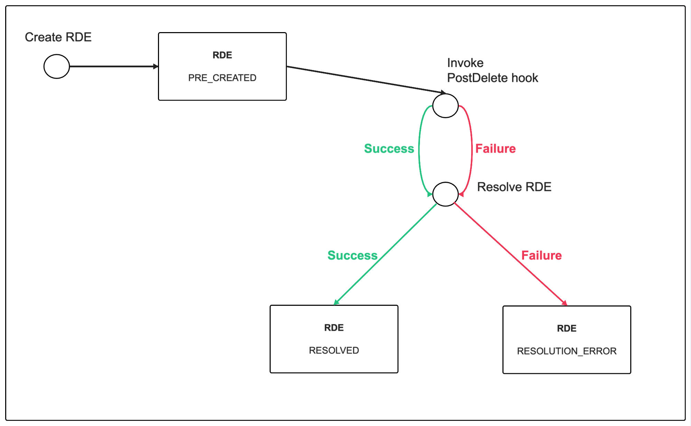
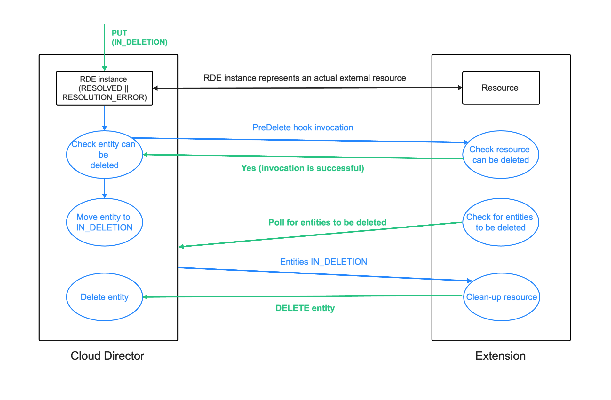
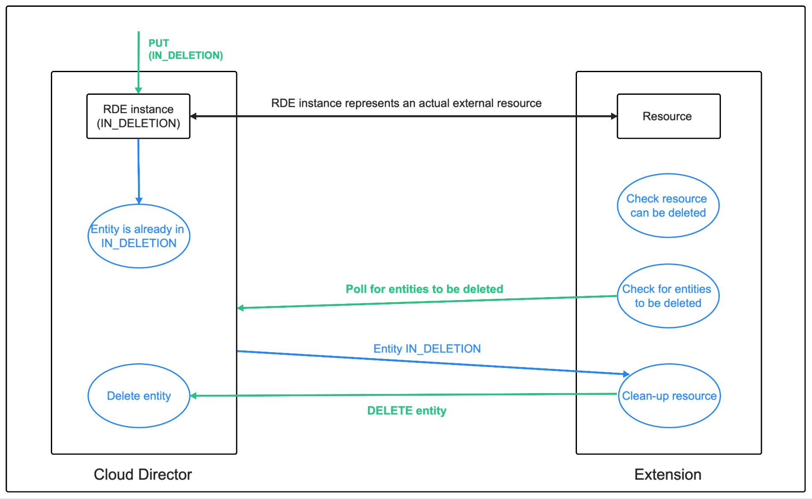
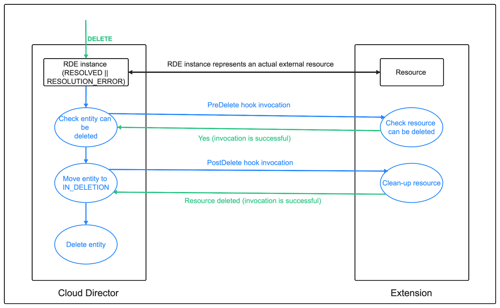
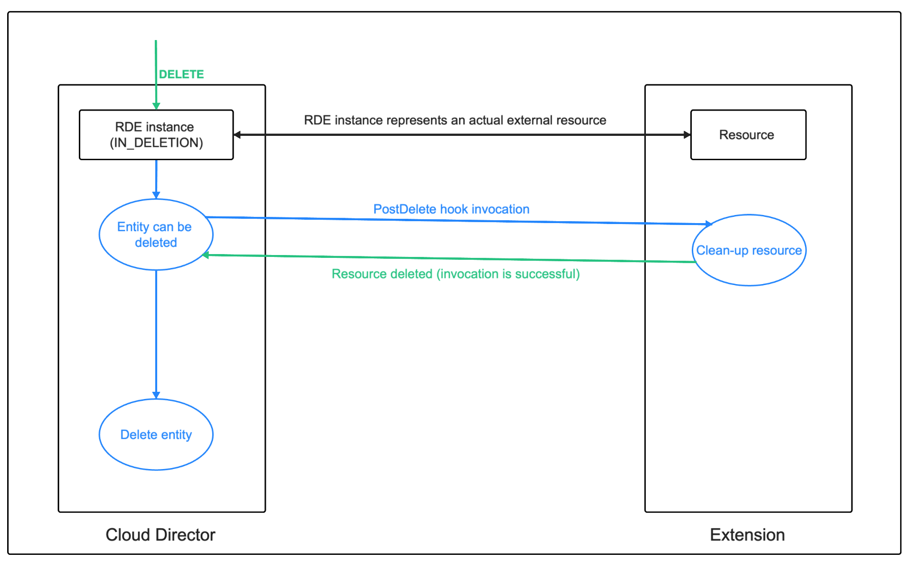
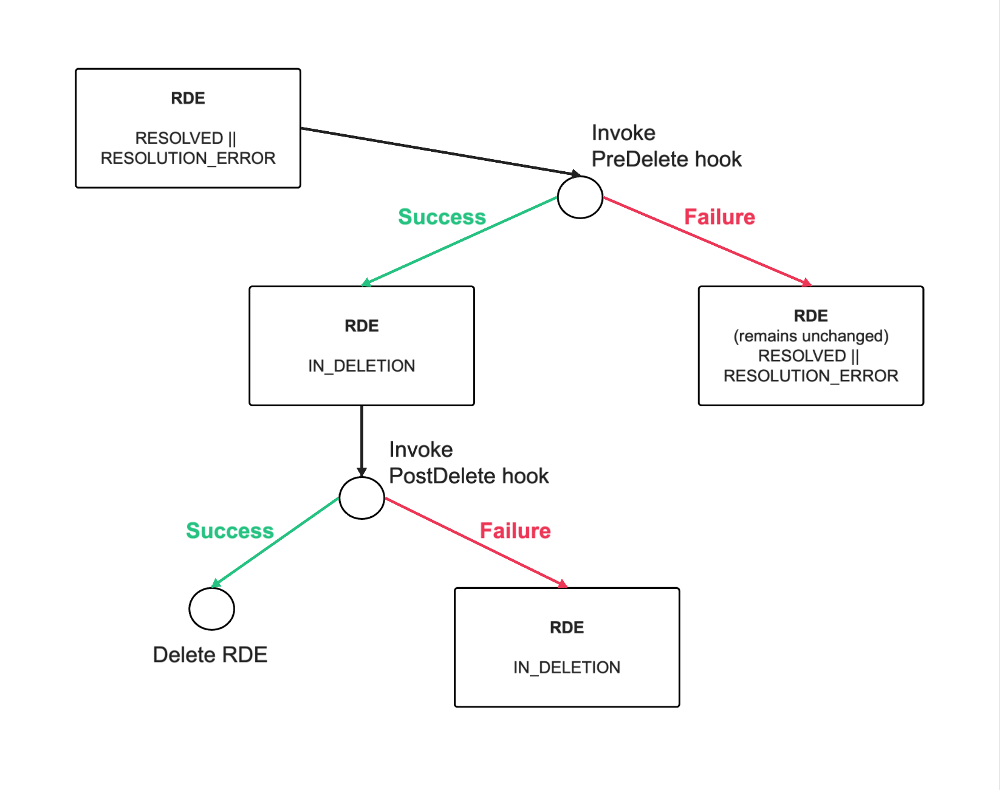
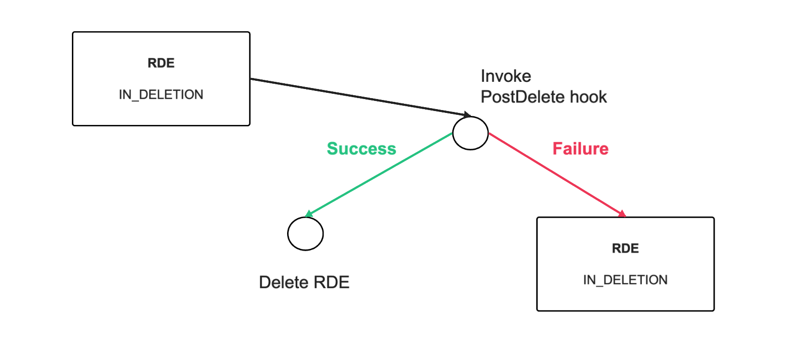

# Runtime Defined Entity Behaviors

## Prerequisites
We recommend you get familiar with the concepts of [Defined Entity Types](), [Defined Entities]() and [Interfaces]() before moving on to Behaviors. 
<!-- TODO add links to RDE documentation -->

## Overview
Runtime Defined Entity Behaviors (or just Behaviors) are operations which execute custom logic in Cloud Director. 

A number of behavior execution types are supported:
- [Webhook behaviors](webhook-behaviors.md)
- [MQTT behaviors](mqtt-behaviors.md)
- [VRO behaviors](vro-behaviors.md)
- [AWS Lambda behaviors](aws-lambda-behaviors.md)
- [Built-in FaaS behaviors](built-in-faas-behaviors.md)
- [No-op behaviors](no-op-behaviors.md)

There is [access control](#behaviors-access-control) in place for what level of access a user needs to have to a defined entity instance in order to be able to execute a specific behavior (operation) on that entity. In addition to directly executing a behavior on a defined entity, behaviors can also be configured to be automatically executed in relation to the defined entity’s lifecycle events (PostCreate, PostUpdate, PreDelete, PostDelete). What is more, ever since VCD 10.5.1 behaviors can also be invoked statically (without the need to invoke them on a defined entity).

## General concepts
### Interface Behaviors
Behaviors are created as part of an Interface (a collection of Behaviors). 

```
POST /cloudapi/1.0.0/interfaces/<interface-id>/behaviors
```

```json
{ 
    "name": "noopBehavior",
    "execution" : {
        "type": "noop"
    }
}
```
Response:
```json
{
    "name": "noopBehavior",
    "id": "urn:vcloud:behavior-interface:noopBehavior:vmware:test:1.0.0",
    "ref": "urn:vcloud:behavior-interface:noopBehavior:vmware:test:1.0.0",
    "description": null,
    "execution": {
        "type": "noop"
    }
}
```

### Type Behaviors
Each RDE Type implements one or more interfaces. It is possible to override the execution and description of each interface behavior (in the implemented interfaces) in the RDE type:

```
PUT cloudapi/1.0.0/entityTypes/<entity-id>/behaviors/<behavior-ref>
```

```json
{
    "name": "noopBehavior",
    "description": "Some description",
    "execution": {
             "type": "WebHook",
             "id": "testWebHook",
             "href": "..." ,
             "_internal_key": "...",
             "execution_properties": {
                "actAsToken": true
             }
    }
}
```
Response:

```json
{
    "name": "noopBehavior",
    "id": "urn:vcloud:behavior-type:noopBehavior:vmware:testType:1.0.0:vmware:test:1.0.0",
    "ref": "urn:vcloud:behavior-interface:noopBehavior:vmware:test:1.0.0",
    "description": "Some description",
    "execution": {
        "id": "testWebHook",
        "href": "...",
        "type": "WebHook",
        "execution_properties": {
            "actAsToken": true
        }
    }
}
```

When executing a behavior on a RDE instance, if that behavior is overriden in the RDE type, the Type Behavior will be executed (even if the behavior is invoked by `ref`).
### Behavior Definition
All types of behavior execution have a common definition structure:

```json
{
    "name": "noopBehavior",
    "id": "urn:vcloud:behavior-type:behaviorName:typeVendor:typeName:typeVersion:interfaceVendor:interfaceName:interfaceVersion",
    "ref": "urn:vcloud:behavior-interface:behaviorName:interfaceVendor:interfaceName:interfaceVersion",
    "description": null,
    "execution": {
        "type": "...",
        "execution_properties": {...}
    }
}
```
The behavior __execution type__ is set in the `type` field of the `execution`. 
#### Behavior id vs. ref
As you can see the behavior has both an `id` and a `ref`. Their values can be both the same or different. This is depending on whether the behavior is overriden in a Defined Entity Type. More information on how to override a behavior can be found [here](#type-behaviors). 

The `id` property holds the actual behavior id. If the behavior is not overriden, it is a `behavior-interface` id: 
```
urn:vcloud:behavior-interface:behaviorName:interfaceVendor:interfaceName:interfaceVersion
```
Otherwise, it is a `behavior-type` id: 
```
urn:vcloud:behavior-type:behaviorName:typeVendor:typeName:typeVersion:interfaceVendor:interfaceName:interfaceVersion
```

The `ref` property always holds a reference to the interface behavior to be used for polymorphic behavior invocations - it always holds the `behavior-interface` id.

#### Special execution properties
There are some special properties which can be set in the behavior definition `execution` or `execution_properties`.
- scope - `static`/`dynamic` - default is `dynamic`. This property sets the scope of the behavior. If set to `dynamic` - the behavior can only be invoked on a RDE instance. If set to `static` behavior can be invoked both statically (without a RDE instance) and dynamically. More about static and dynamic behaviors can be found [here](#dynamic-vs-static-behaviors).

- fields with prefix `_internal_` - field is write-only – once it is set it cannot be obtained through a GET request on the behavior. The field value is saved encrypted in the DB. It is only accessible to Cloud Director (i.e. the shared secret in webHook behaviors). These fields work on top level in the behavior `execution` or `execution_properties`.

```json
"execution": {
         "type": "...",
         "_internal_key": "...",
         "execution_properties": {
             "_internal_key_1": "..."
         }
}
```
- fields with prefix `_secure_` - field is write-only - once it is set it cannot be obtained through a GET request on the behavior. The field value is saved encrypted in the DB. However, this field is accessible to the behavior execution code. This means a different thing in the context of different types of behaviors (i.e. these fields are accessible to the webHook behaviors' template). These fields work on top level in the behavior `execution` or `execution_properties`.

```json
 "execution": {
         "type": "...",
         "_secure_key": "...",
         "execution_properties": {
             "_secure_key_1": "..."
         }
}
```
- `actAsToken` - `boolean` (default is `false`) – set to true if you want to include a Cloud Director act-as token in the behavior invocation arguments (depending on the type of behavior you may want to receive the act-as token in order to make additional API calls to VCD). The token invalidates when the behavior execution completes (the behavior invocation task is completed). The token is created on behalf of the user who invokes the behavior. This property is part of the `execution_properties`.

```json
 "execution": {
         "type": "...",
         "execution_properties": {
             "actAsToken": "true"
         }
}
```

Here is a sample API call for creating a behavior:

```
POST /cloudapi/1.0.0/interfaces/<interface-id>/behaviors
```
```json
{ 
    "name": "noopBehavior",
    "execution" : {
        "type": "noop"
    }
}
```
Response:

```json
{
    "name": "noopBehavior",
    "id": "urn:vcloud:behavior-interface:noopBehavior:vmware:test:1.0.0",
    "ref": "urn:vcloud:behavior-interface:noopBehavior:vmware:test:1.0.0",
    "description": null,
    "execution": {
        "type": "noop"
    }
}
```

## Behavior Invocation
Behavior invocation is an asynchronous operation in Cloud Director since a behavior execution is a long running process. For each behavior invocation, a `BEHAVIOR_INVOCATION` task is created to track the execution. 

Behaviors can be defined as dynamic or static.

The invocation of dynamic behaviors applies only to their existence on a defined entity - they need an RDE instance to be invoked on.

Static (or standalone) behaviors do not need to refer to a defined entity instance in order to execute. However, such behaviors can be executed on a defined entity instance as well.

By default, behaviors as created as dynamic. In VCD 10.4.3 and VCD 10.5.1+ there is the option to define a behavior as static as well.

### Dynamic Behavior Invocation
A behavior invocation on a defined entity is done with the following API call:

```
POST /cloudapi/1.0.0/entities/<entity-id>/behaviors/<behavior-id>/invocations
```
```json
{
    "arguments": {
        "x": 7
    }, 
    "metadata": {
        "y": 6
    } 
}
```

Response:
```
202 Accepted

Headers:
Location: https://<vcd-host>/api/task/xxxxxxxx-xxxx-xxxx-xxxx-xxxxxxxxxxxx
```
The `<entity-id>` is the id of the entity you wish to invoke the behavior on.

### Static/Standalone Behavior Invocation
A static/standalone behavior invocation is done with the following API call:
```
POST /cloudapi/1.0.0/interfaces/<interface-id>/behaviors/<behavior-id>/invocations
```
```
Response:
202 Accepted

Headers:
Location: https://<vcd-host>/api/task/xxxxxxxx-xxxx-xxxx-xxxx-xxxxxxxxxxxx
```
The `<interface-id>` is the id of the interface which the behavior is defined in.

### Invocation Arguments
When invoking a behavior, an API user can supply arguments and metadata to the behavior invocation. However, apart from the user defined, the behavior executor receives some additional metadata information upon execution.
#### User Defined Invocation Arguments
The user defined invocation arguments are defined in the body of the behavior invocation request.

```json
{
    "arguments": {
        "x": 7,
        ...
    }, 
    "metadata": {
        "y": 6,
        ...
    } 
}
```
#### Payload Behavior Execution Code Recieves
The different types of behavior execution types have a different format of the payload which the custom execution code receives. More detailed information on what payload each behavior execution type receives can be found in the dedicated documentation for this execution type:
- [Webhook behaviors](webhook-behaviors.md)
- [MQTT behaviors](mqtt-behaviors.md)
- [VRO behaviors](vro-behaviors.md)
- [AWS Lambda behaviors](aws-lambda-behaviors.md)
- [Built-in FaaS behaviors](built-in-faas-behaviors.md)
- [No-op behaviors](no-op-behaviors.md)

### Behavior Invocation Task
Each behavior invocation is tracked by a `BEHAVIOR_INVOCATION` task. Once the behavior execution completes, the tracking task will also complete. If the behavior execution is successful, the task will succeed and the result of the execution will be in the `result` field of the task. If the behavior execution fails, the task will also fail with the appropriate error in the `error` field of the task. The execution result is always a JSON-encoded string (or null).

If the behavior execution type supports a behavior execution log, a reference to the log will be in the `resultReference` of the task.

API call to get a task:

```
GET /api/task/<task-id>
```
Response:
```json
{
    "otherAttributes": {},
    "link": [
        {
            "otherAttributes": {},
            "href": "https://127.0.0.1:8443/api/task/d5ca75e4-9d14-4a9e-98d2-1fbdb4ce7d97",
            "id": null,
            "type": "application/vnd.vmware.vcloud.task+xml",
            "name": "task",
            "rel": "edit",
            "model": null,
            "vCloudExtension": []
        },
        {
            "otherAttributes": {},
            "href": "https://127.0.0.1:8443/api/task/d5ca75e4-9d14-4a9e-98d2-1fbdb4ce7d97",
            "id": null,
            "type": "application/vnd.vmware.vcloud.task+json",
            "name": "task",
            "rel": "edit",
            "model": null,
            "vCloudExtension": []
        }
    ],
    "href": "https://127.0.0.1:8443/api/task/d5ca75e4-9d14-4a9e-98d2-1fbdb4ce7d97",
    "type": "application/vnd.vmware.vcloud.task+json",
    "id": "urn:vcloud:task:d5ca75e4-9d14-4a9e-98d2-1fbdb4ce7d97",
    "operationKey": null,
    "description": null,
    "tasks": null,
    "name": "task",
    "owner": {
        "otherAttributes": {},
        "href": "",
        "id": "urn:vcloud:entity:vmware:testType:92016846-f98b-400e-aa4b-db4a4c6b9007",
        "type": "application/json",
        "name": "entity",
        "vCloudExtension": []
    },
    "error": null,
    "user": {
        "otherAttributes": {},
        "href": "https://127.0.0.1:8443/api/admin/user/3b81c0f4-5463-4177-aa6c-26e603323d6c",
        "id": "urn:vcloud:user:3b81c0f4-5463-4177-aa6c-26e603323d6c",
        "type": "application/vnd.vmware.admin.user+xml",
        "name": "administrator",
        "vCloudExtension": []
    },
    "organization": {
        "otherAttributes": {},
        "href": "https://127.0.0.1:8443/api/org/a93c9db9-7471-3192-8d09-a8f7eeda85f9",
        "id": "urn:vcloud:org:a93c9db9-7471-3192-8d09-a8f7eeda85f9",
        "type": "application/vnd.vmware.vcloud.org+xml",
        "name": "System",
        "vCloudExtension": []
    },
    "progress": null,
    "params": null,
    "details": "",
    "vcTaskList": {
        "otherAttributes": {},
        "vcTask": [],
        "vCloudExtension": []
    },
    "result": { // the behavior result
        "resultContent": "{\"arguments\":{\"x\":7},\"entityId\":\"urn:vcloud:entity:vmware:testType:92016846-f98b-400e-aa4b-db4a4c6b9007\",\"typeId\":\"urn:vcloud:type:vmware:testType:1.0.0\",\"entity\":{\"entity\":{\"VcdVm\":{\"name\":true}}}}",
        "resultReference": null
    },
    "status": "success",
    "operation": "Invoked noopBehavior test(urn:vcloud:entity:vmware:testType:92016846-f98b-400e-aa4b-db4a4c6b9007)",
    "operationName": "executeBehavior",
    "serviceNamespace": "com.vmware.vcloud",
    "startTime": "2024-03-06T14:11:57.473+0200",
    "endTime": "2024-03-06T14:11:59.989+0200",
    "expiryTime": "2024-06-04T14:11:57.473+0300",
    "cancelRequested": false,
    "vCloudExtension": []
}
```

### Behavior Execution Log
AWSLambda behaviors and BuiltInFaaS behaviors support having a behavior execution log. A reference to the log is saved in the `resultReference` of the behavior invocation task:

```json
{
...
"result": {
        "resultContent": null,
        "resultReference": {
            "otherAttributes": {},
            "href": "https://<vcd-host>/cloudapi/1.0.0/entities/<entity-id>/behaviors/<behavior-id>/invocations/e7b750e0-4b4e-4cf2-9277-2aa9d2af5349/log",
            "id": "e7b750e0-4b4e-4cf2-9277-2aa9d2af5349",
            "type": "text/plain",
            "name": "behaviorLog",
            "vCloudExtension": []
        }
    }
...
}
```

Using the `href` from the `resultReference` field, a user can download a particular log file if the user has the right to invoke the behavior on the specified entity.

The lifetime of log entries can be configured in the `behavior.logs.lifetime.hours` configuration property. The default is 48 hours.
## Behaviors Access Control
### Dynamic Behaviors Access Control
Dynamic behaviors have an access control mechanism for execution based on the RDE instance which the behavior is invoked on. The access controls are defined in the defined entity type scope and specify what minimum level of access an API user must have to a defined entity instance of that type in order to invoke the specific behavior on that defined entity instance. If no behavior access control is created for a specific RDE Type and a specific behavior, then this behavior is effectively not executable on any of the RDE instances of the type.

Behavior executions are not subject to any access control rules if the execution is started as a [RDE lifecycle hook](#runtime-defined-entity-lifecycle-hooks) execution.

Example API call to create a behavior access control:
```
POST /cloudapi/1.0.0/entityTypes/<entity-type-id>/behaviorAccessControls
```
```json
{
    "behaviorId": "<behavior-id>",
    "accessLevelId": "urn:vcloud:accessLevel:ReadWrite"
}
```

The possible access levels are:
- `urn:vcloud:accessLevel:ReadOnly` - if `accessLevelId` is set to this value, an API user must have at least RO (read-only) access to a defined entity instance in order to invoke the behavior with id `<behavior-id>` on that defined entity instance
- `urn:vcloud:accessLevel:ReadWrite`- if `accessLevelId` is set to this value, an API user must have at least RW (read-write) access to a defined entity instance in order to invoke the behavior with id `<behavior-id>` on that defined entity instance
- `urn:vcloud:accessLevel:FullControl`- if `accessLevelId` is set to this value, an API user must have FC (full control) access to a defined entity instance in order to invoke the behavior with id `<behavior-id>` on that defined entity instance

More information on RDE access control can be found [here](). <!-- TODO add link -->

### Static Behaviors Access Control
Currently, static behaviors do not have an access control mechanism for execution.

## Runtime Defined Entity Lifecycle Hooks
Behaviors can be configured to execute at the different lifecycle stages of a defined entity:
- [Post Create](#post-create-behavior-hook)
- [Post Update](#post-update-behavior-hook)
- [Pre Delete](#pre-delete-behavior-hook)
- [Post Delete](#post-delete-behavior-hook)

Hook behaviors' executions are triggered as part of each API call on the entity leading any of the forementioned defined entity lifecycle stages (e.g. API call for creating a defined entity). 

A failure in the execution of some of the hooks may cancel the requested entity operation. In this case, the operation can be forced by "turning-off" the hook execution. This is done by adding the `invokeHooks` query parameter to the request and setting its value to `false`. This query parameter can be used only bu user who have administrative rights to the defined entity type of the entity. Otherise, the request will fail with `OperationDenied` exception.

Hook behaviors are configured at the defined entity type level as part of the type definition. The hook behaviors must be defined in one of the interfaces that the defined entity type implements. 

Example RDE Type definition with hooks:
```json
{
    "name": "testType",
    "description": "testType",
    "nss": "testType",
    "version": "1.0.0",
    "inheritedVersion": null,
    "externalId": null,
    "schema":  {...},
    "interfaces" : ["urn:vcloud:interface:vmware:test:1.0.0"],
    "hooks": {
        "PostCreate": "urn:vcloud:behavior-interface:postCreateHook:vendorA:containerCluster:1.0.0",
        "PostUpdate": "urn:vcloud:behavior-interface:mksPostUpdateBehavior:vendorA:containerCluster:1.0.0",
        "PreDelete" : "urn:vcloud:behavior-interface:postUpdateBehavior:vendorA:containerCluster:1.0.0",
        "PostDelete" : "urn:vcloud:behavior-interface:postDeleteBehavior:vendorA:containerCluster:1.0.0"
    },
    "vendor": "vmware",
    "readonly": false
}
```

Behavior executions as lifecycle hooks are not subject to any access control rules.

### Post Create Behavior Hook
The post-create hook behavior is invoked automatically on a defined entity instance after its creation. It can be used to create an external resource which the RDE represents, or to make some additional changes to the RDE's entity contents depending on the specific business logic.

To trigger a post-create hook behavior, you need to create an RDE instance via the API:
```
POST /cloudapi/1.0.0/entityTypes/<entity-type-id>
```
Response:
```
202 Accepted

Headers:
...
Location: https://<vcd-host>/api/task/<task-id>
...
```
The RDE create operation is a long-running process in Cloud Director which is tracjed by a task. If the RDE creation triggers a post-create hook the task returned in the `Location` header of the create RDE API call response is the behavior invocation task.

If the post-create behavior execution completes __successfully__, then the resolve operation is automatically invoked on the defined entity. If the execution __fails__, then the defined entity is set into an error state.



### Post Update Behavior Hook
The post-update hook behavior is invoked automatically after a defined entity instance update. This hook behavior can be used to update the external resource that the RDE is backed by accordingly.

The post-update hook behavior execution does not affect the entity state of the RDE instance in any way.

To trigger a post-update hook behavior, you need to update an RDE instance via the API:
```
PUT /cloudapi/1.0.0/entities/<entity-id>
```
Response:
```
200 OK

Headers:
...
X-VMWARE-VCLOUD-TASK-LOCATION: https://<vcd-host>/api/task/<task-id>
...
```
When a defined entity with a post-update hook is updated, the behavior invocation task is returned in a  `X-VMWARE-VCLOUD-TASK-LOCATION` header in the response of the update RDE API call.

### Pre Delete & Post Delete Behavior Hooks (Multi-stage RDE Deletion)
The pre-delete and post-delete hook behaviors are hooked to the RDE deletion operation. A multi-stage entity deletion process can be achieved using these hooks. 

#### Pre Delete Hook Behavior
The pre-delete hook is intended to be used as a pre-check for whether an entity can be deleted depending on the extension logic. A failure of the pre-delete hook will abort the entity deletion leaving the entity unchanged.

The pre-delete hook behavior is the first executed operation when an entity is requested to be marked for deletion or requested to be deleted. 

An entity is requested to be marked for deletion by moving the entity to `IN_DELETION` state ([more details](#moving-entities-to-in_deletion-state)).

An entity is requested to be deleted by executing a `DELETE` entity API call:
```
DELETE /cloudapi/1.0.0/entities/<entity-id>
```

If the pre-delete hook execution is successful, the requested entity operation is executed (moving entity to `IN_DELETION` or deleting entity). However, if the hook execution fails, then the entity deletion is "canceled" - the entity remains unchanged. 

If an entity is in an `IN_DELETION` entity state before a pre-delete hook execution, the hook is not executed. Cloud Director proceeds as if the pre-delete hook execution is successful (we assume entity can be deleted).

#### Post Delete Hook Behavior
The intended use of the post-delete hook is to do any additional clean-up related to the entity deletion - e.g clean-up any external resources which this entity represents. A failure of the post-delete hook will abort the entity deletion leaving the entity as marked for deletion (in `IN_DELETION` state).

The post-delete hook behavior is invoked immediately before the entity is deleted from the DB (after pre-delete hook execution if there is one). If the hook execution is successful, the entity is permanently deleted. If the hook execution fails, the entity deletion fails and entity remains in `IN_DELETION` state.

#### Multi-stage RDE Deletion 
The multi-stage RDE deletion allows RDE instances to be deleted over several stages and the deletion process can be stopped at any of these stages. This provides an opportunity for the solution backend to release and cleanup the resources that an RDE instance represents before the instance is permanently deleted from Cloud Director. 

The multi-stage deletion can be set-up to be asynchronous or synchronous depending on they way the solution backend will get notified of an entity's deletion starting.

__Asynchronous multi-stage deletion__

In the async scenario, the solution backend is expected to poll the Cloud Director API for entities which are marked for deletion.

To put it simply, the async multi-stage deletion involves the following steps:

1. Marking entities for deletion by moving them to `IN_DELETION` state (more info [here](#moving-entities-to-in_deletion-state)).
2. The solution backend polls for entities in `IN_DELETION` state and starts the deletion process for them (more info [here](#polling-for-entities-to-in_deletion-state)).
3. Once resource clean-up is completed, solution backend can issue a `DELETE` API call for all entities, which are ready to be permanently deleted.





__Synchronous multi-stage deletion__

In the synchronous scenario, the solution backend is expected to configure a post-delete hook on the RDE Type to handle cleaning-up any additional resources.

The following diagrams shows the synchronous multi-stage deletion flow:





The delete operation is kick-started with the `DELETE` RDE API call:

```
DELETE /cloudapi/1.0.0/entities/<entity-id>
```
Response:
```
202 Accepted

Headers:
Location: https://<vcd-host>/api/task/<task-id>
```

The `deleteDefinedEntity` task can be found in the `Location` header of the response of the `DELETE` RDE API call. The operation field of this task holds references to the pre-delete and post-delete hook executions.

```json
{
    ...
    "id": "urn:vcloud:task:bf1ba5ab-9a26-4061-ab5a-1fa7a4583100",
    "operationKey": null,
    "description": null,
    "tasks": null,
    "name": "task",
    "owner": {
        "otherAttributes": {},
        "href": "",
        "id": "urn:vcloud:entity:vmware:testType:0f9bf154-63c3-43f1-a190-aa1173152412",
        "type": "application/json",
        "name": "entity",
        "vCloudExtension": []
    },
    ...
    "result": null,
    "status": "success",
    "operation": "PreDelete hook: urn:vcloud:task:dc3b9f64-93a7-49a5-b3d3-2ea9666cf1f9. PostDelete hook: urn:vcloud:task:7dd7dc68-a84a-4130-a653-285877502ce8.",
    "operationName": "deleteDefinedEntity",
    ...
}
```
The following diagrams show what happens with the RDE's state depending on the success or failure of the hook executions:






As you can see, if the post-delete hook fails, the entity will remain in `IN_DELETION` state and will not be deleted.

#### Moving Entities to IN_DELETION State

A RDE instance can be moved to `IN_DELETION` state by issuing a `PUT` API call on the defined entity setting the `entityState` field to `IN_DELETION`:

```
PUT /cloudapi/1.0.0/entities/<entity_id>
```

```json
{
    "name": "test",
    "externalId": null,
    "entity": {
        "entity": {
            "VcdVm": {
                "name": false
            }
        }
    },
    "entityState": "IN_DELETION",
    ...
}
```
Response:

```
200 OK
```
If there is a pre-delete hook defined in the RDE type of the entity, the hook will be executed prior to moving the entity into `IN_DELETION` state. If the hook execution succeeds, the entity is moved into `IN_DELETION` state. Otherwise, the entity remains unchanged.

In the case of pre-delete hook existing, the `PUT` call will respond with `202 Accepted` and a task will be returned in the `Location` header of the response:
Response:
```
202 ACCEPTED

Headers:
Location: https://localhost:8443/api/task/06533e8a-e3a0-4502-9cb7-5c758e6da815
```

And the Update RDE task holds a reference to the actual pre-delete hook invocation task:
```json
 {
    ...
    "href": "https://localhost:8443/api/task/06533e8a-e3a0-4502-9cb7-5c758e6da815",
    "type": "application/vnd.vmware.vcloud.task+json",
    "id": "urn:vcloud:task:06533e8a-e3a0-4502-9cb7-5c758e6da815",
    "operationKey": null,
    "description": null,
    "tasks": null,
    "name": "task",
    "owner": {
        "otherAttributes": {},
        "href": "",
        "id": "urn:vcloud:entity:vmware:testType1:39f88374-6e03-4d39-8c81-f9e92a3020cf",
        "type": "application/json",
        "name": "entity",
        "vCloudExtension": []
    },
  ...
    "result": null,
    "status": "success",
    "operation": "PreDelete hook: urn:vcloud:task:7d0f585f-75ea-4af1-a94c-5a0727124d8f.", // pre-delete hook task
    "operationName": "updateDefinedEntity",
    ...
}
```

#### Polling for Entities to IN_DELETION State

To get all entities of a RDE Type in state `IN_DELETION`, you `GET` all entities of the RDE Type filtered by `entityState`:

```
GET /cloudapi/1.0.0/entities/types/vmware/testType1/1.0.0?filter=(entityState==IN_DELETION)
```