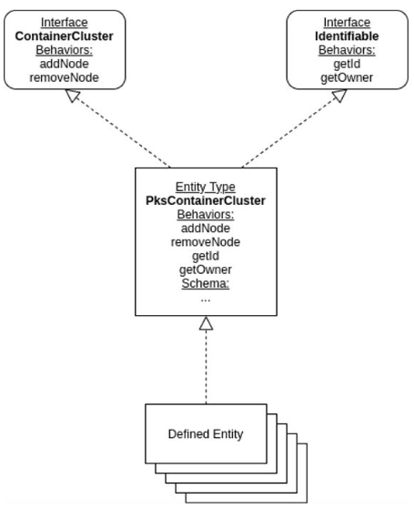

# Runtime Defined Entities Framework

- [Runtime Defined Entities Framework](#runtime-defined-entities-framework)
  - [Introduction](#introduction)
  - [Typical RDE Uses](#typical-rde-uses)
  - [Runtime Defined Entities Concepts](#runtime-defined-entities-concepts)
  - [REST API](#rest-api)
  - [Links to the RDE Components Documentation](#links-to-the-rde-components-documentation)

## Introduction

Cloud Director supports several pre-defined entity types – VMs, vApps,
Networks, etc. The Runtime Defined Entities (RDE) functionality allows
clients to define their own custom entity types with custom
functionality.

The Cloud Director extensibility framework can be used in many different
ways, for example:

- Clients can add custom functionality to Cloud Director that addresses
their specific use cases

- ISVs can create extensions that tightly integrate their software with
Cloud Director

- Third Parties can create and distribute extensions offering new
value-added functionality

- Service Providers could deliver new differentiating capabilities to
their customers

Runtime Defined Entities can greatly simplify the development of
extensions by providing a built-in state management mechanism and the
definition of custom operation execution functionality within Cloud
Director.

## Typical RDE Uses

Several typical ways RDEs can be used by extensions are the following:

- Represent an external resource (e.g. a Container Cluster) and keep its external references in strongly typed JSON document. (c.f. [Defined Entity Type schema](rde-types.md))

- Persist the state of an Extension without the need of an external database. (c.f. [Defined Entities](defined-entities.md))

- Use the [RDE Access Control mechanisms](rde-access-control.md) to manage the users’ access to
resources. (c.f. RDE Access Control)

- Use RDE instances as a Desired State interface to an external system.
(c.f. Field-level Access Control)

RDEs also provide a powerful [versioning mechanism](rde-versions.md), thus simplifying
the management of the extensions’ lifecycle, especially when used in the
context of [Solution Add-Ons](../../extension-sdk/extension-sdk.md).

## Runtime Defined Entities Concepts

A Runtime Defined Entity (RDE) is a package that contains a JSON payload.

Each RDE is an instance of a [RDE Type](rde-types.md) that specifies
the format of the JSON payload using a JSON Schema.

An RDE Type may implement a number of [RDE Interfaces](rde-interfaces.md) that categorize it
conceptually, for example – “Container Cluster”. An RDE Interface may
also define [RDE Behaviors](behaviors-general-concepts.md) that can be executed on RDEs that implement it.

[RDE Behaviors](behaviors-general-concepts.md) are custom executable operations that can be
performed on a Runtime Defined Entity. Behaviors can by defined by clients via several
different mechanisms. RDE Types can be configured to automatically
execute specific Behaviors on certain events during the RDE lifecycle.

RDE Types, their RDE instances, as well as RDE Interfaces are [versioned](rde-versions.md).
They ensure that the schema of an RDE does not change once it is created. They also offer a path to transfer to other versions.

## REST API

All RDE operations are performed via the Cloud Director REST API.

Note that as descirbed in the [Cloud Director API Reference](https://developer.broadcom.com/xapis/vmware-cloud-director-openapi/latest/), the Cloud Director API supports HATEAOS and it is not
necessary to build the REST API request URIs manually -- they can be extracted from the Links.

See this [simple sequence of RDE API requests](defined-entities-simple-requests.md) for
examples of how to perform RDE operations.

## Links to the RDE Components Documentation

- [RDE Interfaces](rde-interfaces.md)
- [RDE Types](rde-types.md)
- [Runtime Defined Entities](defined-entities.md)
- [RDE Behaviors](behaviors-general-concepts.md)
- [RDE Access Control](rde-access-control.md)
- [RDE Versioning](rde-versions.md)
