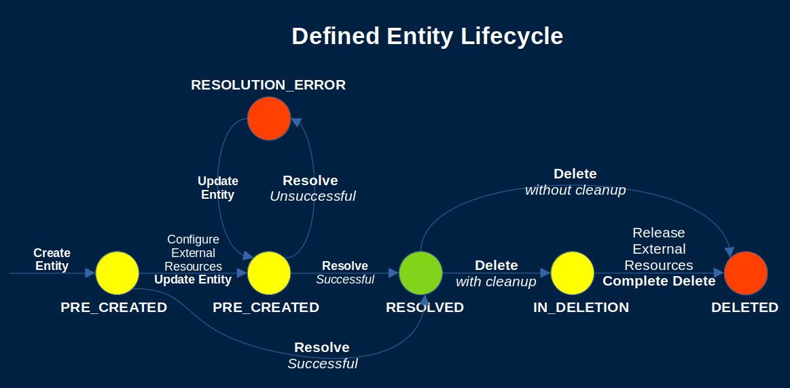

# Runtime Defined Entities

- [Runtime Defined Entities](#runtime-defined-entities)
  - [RDE Lifecycle](#rde-lifecycle)
  - [Creation Phase](#creation-phase)
  - [Utilization Phase](#utilization-phase)
  - [Deletion Phase](#deletion-phase)

## RDE Lifecycle

The lifecycle of a Runtime Defined Entity typically consists of three phases:

- Creation
- Utilization
- Deletion

In simple cases, both the Creation and the Deletion phases can be immediate. In other cases, they can be long-running processes.

The phases are represented via the following RDE states:

- PRE_CREATED
- RESOLVED
- RESOLUTION_ERROR
- IN_DELETION

## Creation Phase

The typical Creation Phase is the following:

- The entity is created and placed in the state `PRE_CREATED`
- The external resources that it will represent are allocated and configured
- The entity is updated with information such as the external resource references
- The entity contents do not have to match the JSON schema of the RDE Type during the creation phase

When the Creation Phase is complete, a resolution of the entity can be performed.
The entity resolution process can be initiated either via a REST API call or [via a hook](rde-hooks.md).

## Utilization Phase

Once the resolution process validates the entity contents against the JSON schema of the entity type,
the entity state is changed to `RESOLVED` and it becomes possible to invoke Behaviors on the entity.

A resolved entity can be updated when needed.
The contents to update a resolved entity must validate successfully against the JSON schema
in order for the operation to succeed.

## Deletion Phase

At the end of its lifecycle, a Runtime Defined Entity can be deleted immediately.

If there are resources managed by the entity that needs to be cleaned up before its full deletion,
however, a deletion process can be initiated instead.

The deletion process can be initiated either via a REST API call or via a hook.
During such process, the entity is in an `IN_DELETION` state
and is fully deleted when the process completes.
