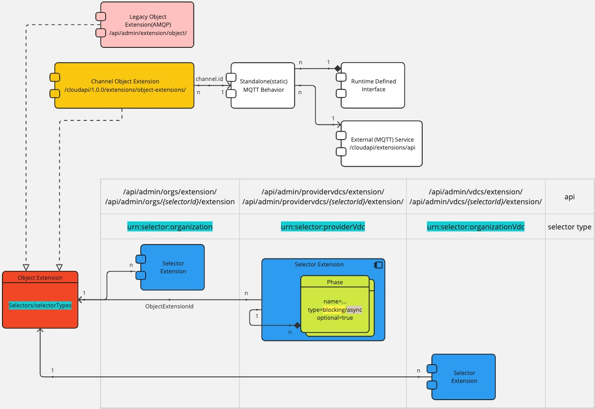
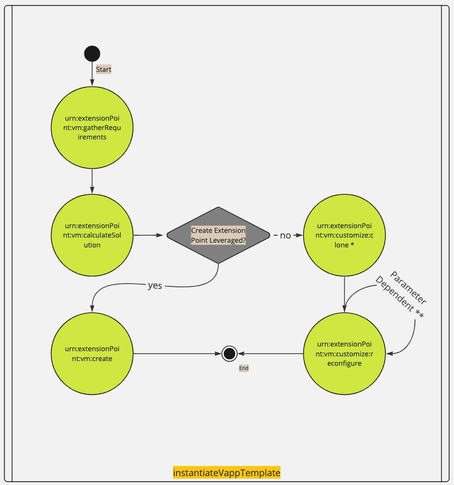
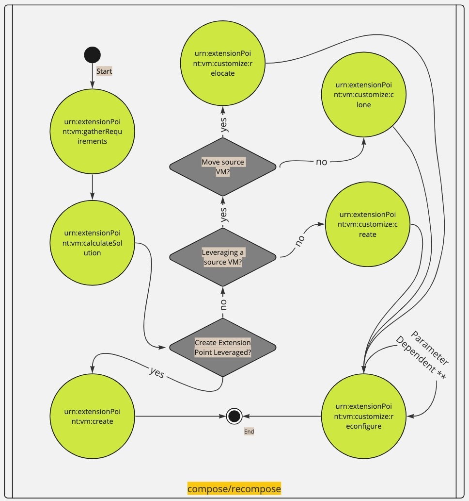
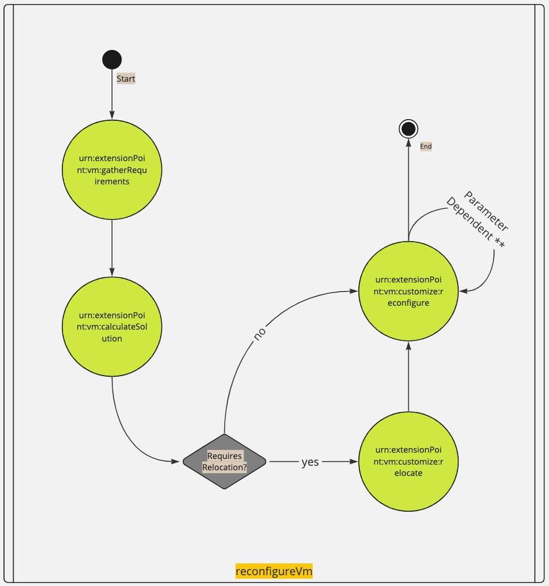
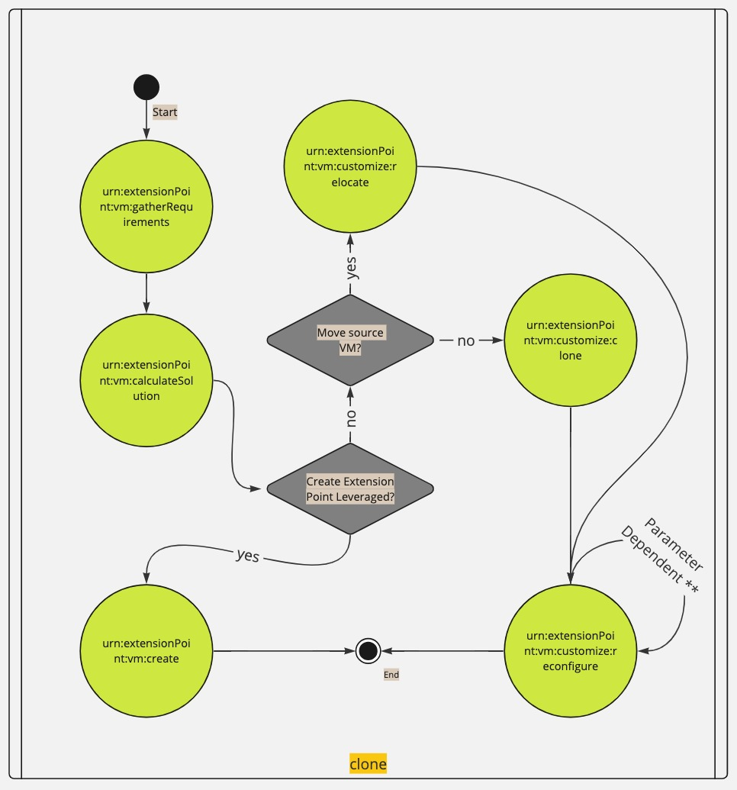
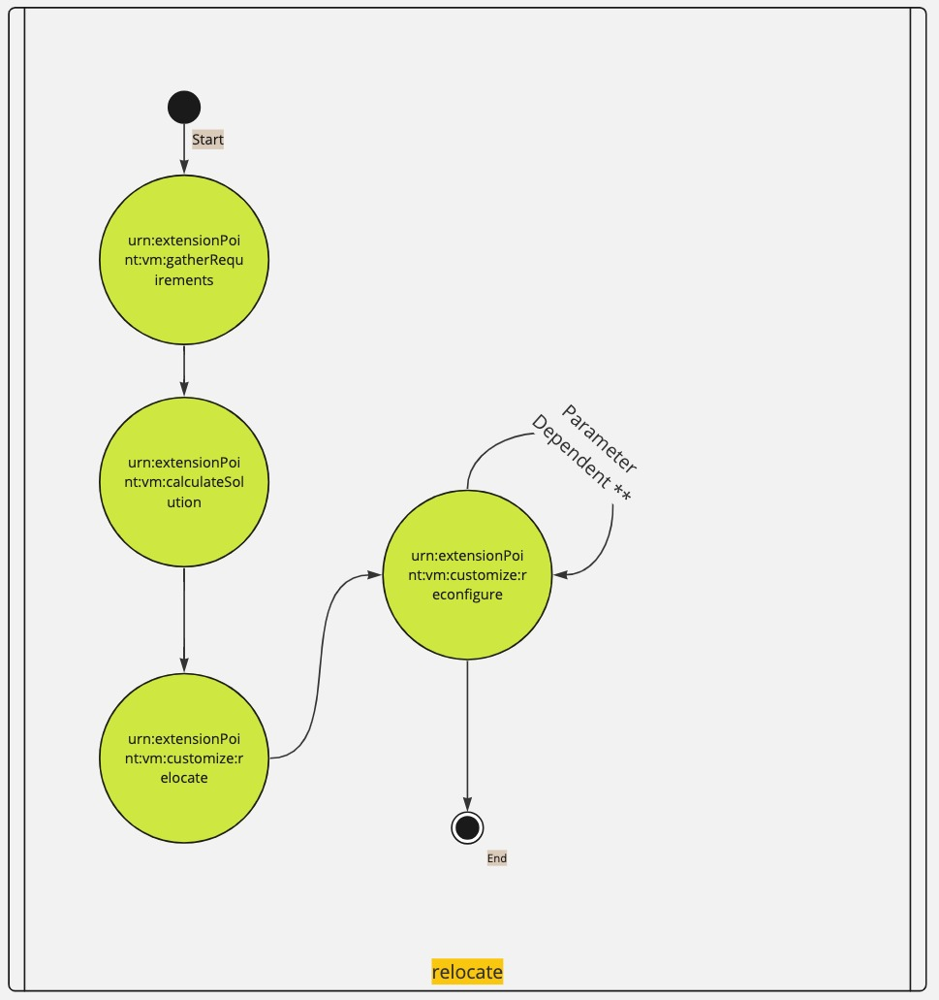

# Object Extensibility
Cloud Director object extensions are external applications that can participate in, influence, or override the logic that Cloud Director applies to workflows like vApp instantiation and placement. Their operation is transparent to system users.

A service provider uses the REST api to [register such extensions and _select_ them on certain _phases_](#extending-a-workflow) of various extensible core workflows. The extension must [implement](#implementing-an-object-extension-backend) a certain protocol and handle request/responses from/to Cloud Director.

## Overview
The following is a high level diagram of the components of the object extensibility framework\
\
where:

* [`Object Extension`](https://developer.vmware.com/apis/vmware-cloud-director/latest/data-structures/ObjectExtension/) defines an extension backend. Based on the type, the way a backend is built varies. There are two flavours:
  * the legacy AMQP based object extensions registered via `/api/admin/extension/object`. They are deprecated since Cloud Director 10.6.
  * the channel object extensions registered via [`/cloudapi/1.0.0/extensions/object-extension`](https://developer.vmware.com/apis/vmware-cloud-director/latest/object-extension/). This document describes the interaction only with this kind. The first channel type that is supported since the introduction of this kind of extensions(10.5.1), is a generic RDE standalone mqtt behavior(part of the Cloud Director RDE framework).
* [`Selector Extension`](https://developer.vmware.com/apis/1601/doc/types/SelectorExtensionType.html) binds an object extension to a _selector type_ `AND` a set of _phases_.
  * `Selector type` represents a context of a workflow execution(for ex. "Place VM" is running withing the context of a VDC). Each workflow may have a distinct sub-set of applicable contexts. When Cloud Director executes a workflow, it uses its applicable contexts to _select_ the `object extensions` which are bound to them.\
  Each type is represented by a specific api endpoint, or an urn alias. The urn alias is used on the `object extension` to narrow down the selector types to which it can be bound.\
  There are two types of selector api endpoints:
    * `/api/admin/{selector-type}/extension` - `selector extensions` registered here will have the `object extension` triggered for any selector of that type(for ex. any organisation)
    * `/api/admin/{selector-type}/{selector-id}/extension` - `selector extensions` registered here will have the `object extension` triggered for one particular selector of that type and that id(for ex. the organisation whose id==`selector-id`)
  * `Phase` represents a lifecycle stage from one or more workflows. When executing a workflow, Cloud Director _invokes_ `object extensions` bound to that phase(**and** to the selector type context). 
  
## Extending a workflow
An object extension can participate as a peer of the system to:

* change the outcome of workflows - `phase.type=blocking`; for example, it might use information provided by the system to place a VM on a specific host or assign it a specific storage profile
* observe without changing the outcome of workflows; typically the selection will be `phase.type=async`, but `phase.type=blocking` may also be used for such cases, where the extension has to only conditionally change the outcome

Only a sub-set of core workflows are extensible and have well-defined lifecycle _phases_ and applicable _selector types_. Multiple `object-extensions` at a time can be candidates for execution for a given `phase`. When Cloud Director selects the `object-extensions` based on the `phase` and the `selector types`, it then proceeds to order them based on the `selectorExtension.priority` field and filter based on the _phase cardinality_. The _direction of the ordering_(ascending or descending) is specific to the workflow and the cardinality depends on the particular `phase`. The _cardinality_ defines the applicable `phase.type` selections and the number of extensions that may be invoked:

* `ALLOW_ONE` - up to one extension, either `async` or `blocking`
* `ALLOW_ONE_BLOCKING` - up to one `blocking` extension
* `UNLIMITED` - any number of extensions of any `phase.type`
 
Once the **ordered list** of extensions is determined, it then proceeds to invoke them one by one. It will wait for a response if the phase is selected as `phase.type=blocking`, or continue immediately(to the next extension, or phase, etc) if it is `async`. Each blocking extension influences the input of the next extension for the phase. The way it influences it is specific to the phase - sometimes it could be the output of the previous is the input of the next, or the output is overlayed in some way on the input.

If any of the extension invocations ends in an _error_, including when a `blocking` extension deliberately triggers it(by returning a payload of type `ExtensionErrorMessage`), Cloud Director follows the following procedure:

1. It will attempt to send a message indicating that the last invocation was in error. This has two purposes:
   1. Traceability
   2. To let extensions clean up a potentially broken state.
2. If the `selectorExtension.optional=true`, it will continue with the execution(invoking the next extension/phase/workflow stage, whatever the case may be). Otherwise, the workflow ends and the corresponding workflow `task` will contain details for the error(which may have been forwarded from the extension, in case it triggered it).

> **Note:**
> 
> * It is possible for a `phase` to **not** get any extensions invoked, even though there are selector extensions on it. This can happen if its cardinality does not permit the `phase.type` of the selectors.
> * If an `object-extension` is selected on multiple different `selector types`, it will be invoked once with a priority which is well-defined if it is the same across all `selector extensions`, or one will be chosen otherwise. It is currently undefined as to which priority will be chosen in the latter case.

### Phases

| phase.name                                  | cardinality        | request                | response                |
|---------------------------------------------|--------------------|------------------------|-------------------------|
| urn:extensionPoint:vm:calculateSolution     | UNLIMITED          | PlacementProposalType  | PlacementProposalType   |
| urn:extensionPoint:vm:gatherRequirements    | UNLIMITED          | Requirements           | Requirements            |
| urn:extensionPoint:vm:create                | ALLOW_ONE_BLOCKING | ProvisioningRequest    | ProvisioningResponse    |
| urn:extensionPoint:vm:customize:create      | UNLIMITED          | VmCustomizationRequest | VmCustomizationResponse |
| urn:extensionPoint:vm:customize:reconfigure | UNLIMITED          | VmCustomizationRequest | VmCustomizationResponse |
| urn:extensionPoint:vm:customize:relocate    | UNLIMITED          | VmCustomizationRequest | VmCustomizationResponse |
| urn:extensionPoint:vm:customize:clone       | UNLIMITED          | VmCustomizationRequest | VmCustomizationResponse |

### Extensible workflows







> ** The `phase` can be called multiple times per workflow depending on the parameters that are being set or updated

### Testing the selector extension configuration

Once the `object-` and `selector extensions` are registered, a service provider may test the extensions that are going to be invoked for a given `phase` and a set of `selector types` via the [`Echo Object Extensions`](https://developer.vmware.com/apis/vmware-cloud-director/latest/cloudapi/1.0.0/extensibility/echo/object-extensions/invocations/post/) RESTapi resource. For this purpose, at least a basic `object extension` [backend](#implementing-an-object-extension-backend) should be stood up, which can handle the `phases` and the requests that will be tested.\
Think of this resource as a pseudo workflow, where you can specify the `phase`, the `invocation order`, the `selector context` and the `request` payload.

> **Note:**
>
> A real workflow's phases have pre-defined request/response schemas

#### Example test invocation:
```json
 {
     "request": { "message": "Hello World"},
     "invocationOrder": "LOWEST_PRIORITY_FIRST",
     "selectors": [
         "urn:vcloud:vdc:05472504-6b79-48c8-bb74-7493c14cad7d"
     ],
     "phase": "urn:extensionPoint:vm:customize:create"
 }
```

## Implementing an `object-extension` backend

Cloud Director supports various _channels_ for the communication with the `object-extension`. Each phase has predefined request and response payload [schema](../schemas/obj-ext-phase-payloads.zip) associated with it, which Cloud Director sends, and in the case of `phase.type=blocking` selections, expects to receive. For all _channel_ types, the payloads are wrapped in [envelopes](../schemas/obj-ext-channel-msg.zip):
* `HalfDuplexEnvelope` - used by Cloud Director when sending a request, and by the extension when sending a response
* `ErrorMessageEnvelope` - used by Cloud Director when the last invocation ended in an error

The envelope follows the same pattern mentioned in [message-broker.md#message-schema](message-broker.md#message-schema). This structure allows a single `object extension` to handle varying workflows/phases. The schemas of the payloads related to each particular `phase` are described in the `HalfDuplexEnvelope.payloadType` field. In this way the `object-extension` knows not only how to (de)serialize the payloads, but also how to route the requests to its internal specific handling logic for each `phase`.

Alternatively, extension developers may choose to group `object extensions` to `phases` in a 1:1 relationship, meaning there is a dedicated extension for each particular phase. In this case the routing mentioned above is effectively performed by Cloud Director through the `selector extensions` configuration.

### Standalone mqtt RDE behavior channel
The extension must implement the general RDE behavior invocation contract. The messages sent/received are of `type` `BEHAVIOR_INVOCATION`/`BEHAVIOR_RESPONSE`. The _envelope_ is json encoded in the `payload`(`InvocationArguments.arguments`). Once you decode it, the phase request is again json encoded in its `payload`. 

> **Note:**
> 
> This means that in order to extract the particular phase related request, you must unwrap(decode) two `payload` fields in total, one of which is nested in the other.

#### Procedure

Ideally, the first two points should be part of the installation procedure of the **solution addon**, which packages the overall extension. It should persist the ids of the extension service, RDE interface and behavior, and it should use them when standing up the backend in the third point.

1. Register an `Extension Service`, or reuse an existing one(`/cloudapi/extensions/api`)
2. Create an RDE interface
   1. Create a standalone mqtt behavior, referencing the extension service from the first step.
3. Standup your extension backend.
   1. A mqtt client must establish a web socket connection at `{vcd.host}/messaging/mqtt`
   2. The client must subscribe to the `monitor` topic of the extension service from point 1. It must publish responses to the `respond` topic.
   3. Implement your handling logic - act on received messages, and possibly return a response(for `phase.type=blocking` extensions). Here is an example fully decoded `BEHAVIOR_INVOCATION`, corresponding to the [test invocation](#example-test-invocation) mentioned above:
    ```json
    {
        "type": "BEHAVIOR_INVOCATION",
        "headers": {
            "taskId": "7ce94181-6b78-4147-b7fe-b21558790500",
            "behaviorId": "urn:vcloud:behavior-interface:818c62fc-2316-445c-a4e1-4cee621cbf4c:vmware:BEHAVIOR_ECHO:1.0.0",
            "context": { // not to be confused with the selector types; this is part of the core RDE framework
                "orgId": "urn:vcloud:org:a93c9db9-7471-3192-8d09-a8f7eeda85f9",
                "userId": "urn:vcloud:user:c24078ed-fc83-4474-9130-503a51b6bd94"
            }
        },
        "payload": { // this is a json encoded string originally
            "_execution_properties": {
                "serviceId": "urn:vcloud:extension-api:vmware:echo:0.0.1",
                "actAsToken": false,
                "invocation_timeout": 300
            },
            "typeId": "urn:vcloud:interface:vmware:BEHAVIOR_ECHO:1.0.0",
            "arguments": { // this is the HalfDuplexEnvelope
                "clientRequestId": "obj-ext-test",
                "namespace": "BEHAVIOR_ECHO",
                "envelopeType": "HalfDuplexEnvelope",
                "payloadType": "Echo",
                "phase": "urn:extensionPoint:vm:create",
                "payload": {"message":"Hello World!"}, // this is a json encoded string originally
                "correlationId": "16e8a458-ec93-4285-888e-293c94b5e004"
            },
            "_metadata": {
                "executionId": "730ae625-3fae-4987-b178-cef6bae1f9d9",
                "invocation": {},
                "apiVersion": "39.0",
                "behaviorId": "urn:vcloud:behavior-interface:818c62fc-2316-445c-a4e1-4cee621cbf4c:vmware:BEHAVIOR_ECHO:1.0.0",
                "requestId": "obj-ext-test-f37cbac5-2192-4114-bc58-c1cc9e3a883c",
                "executionType": "MQTT",
                "invocationId": "298c37ce-4854-4576-a3aa-903a92d0904f",
                "taskId": "7ce94181-6b78-4147-b7fe-b21558790500"
            }
        }
    }
    ```
   > **Note:**
   > 
   > If you are using the same extension service with multiple different mqtt behaviors, the messages my not always represent an object extension phase request. In such cases you may route the execution(and (de)serialization) to a proper handler, based on the `BehaviorInvocation.Headers.behaviorId`, or otherwise use a dedicated extension service for the object extension RDE mqtt behavior.
