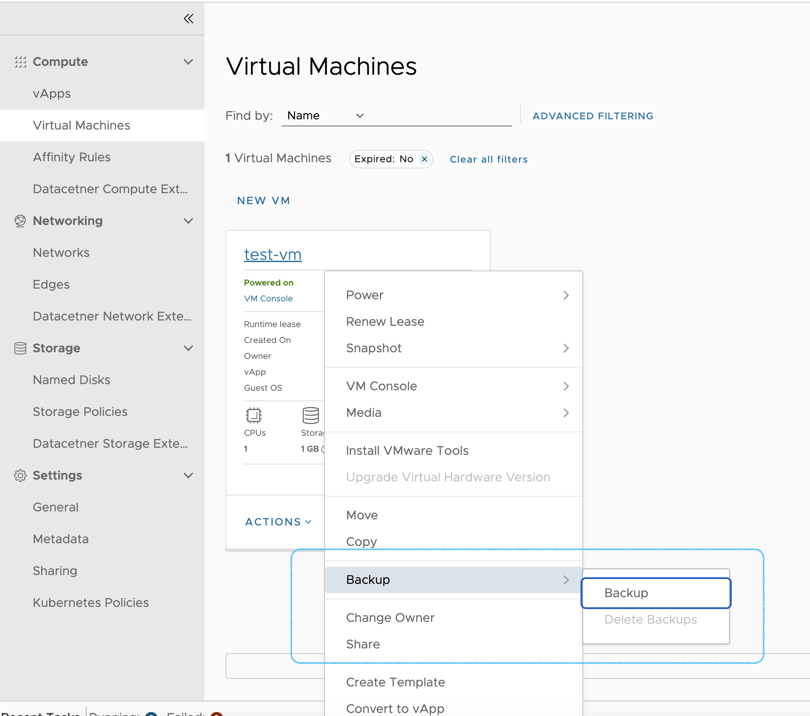
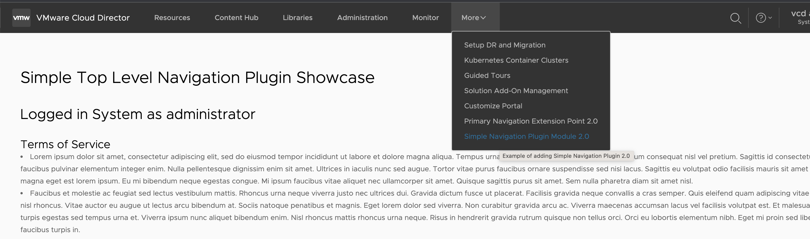
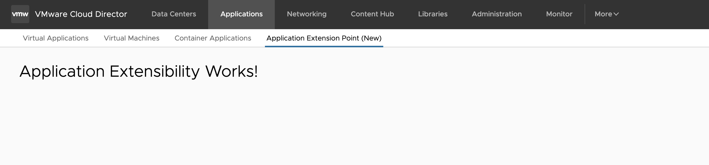
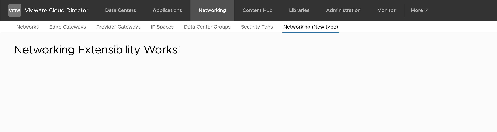
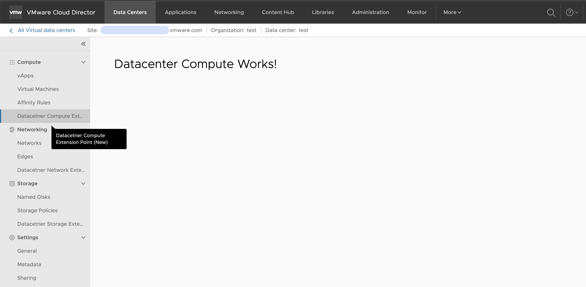
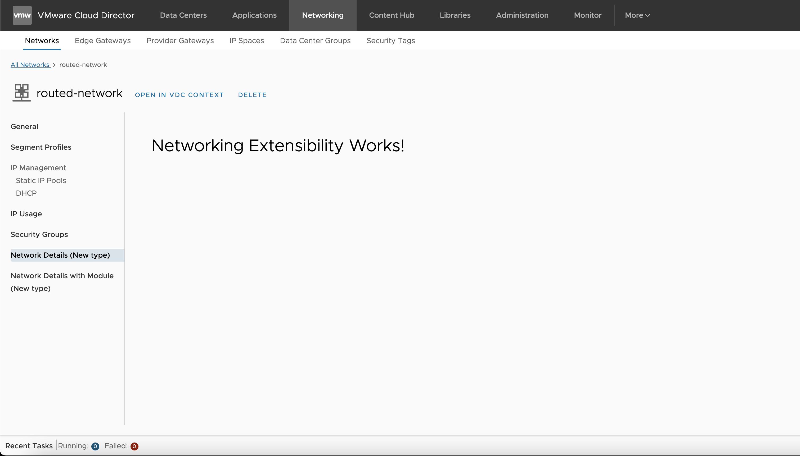
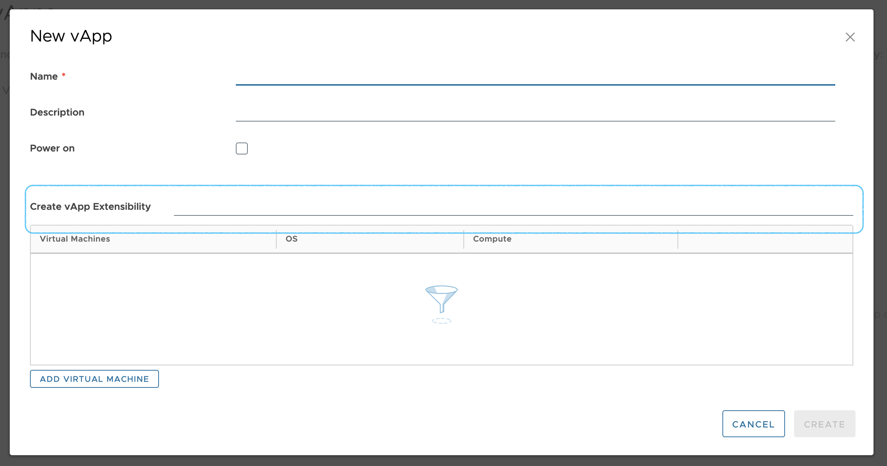
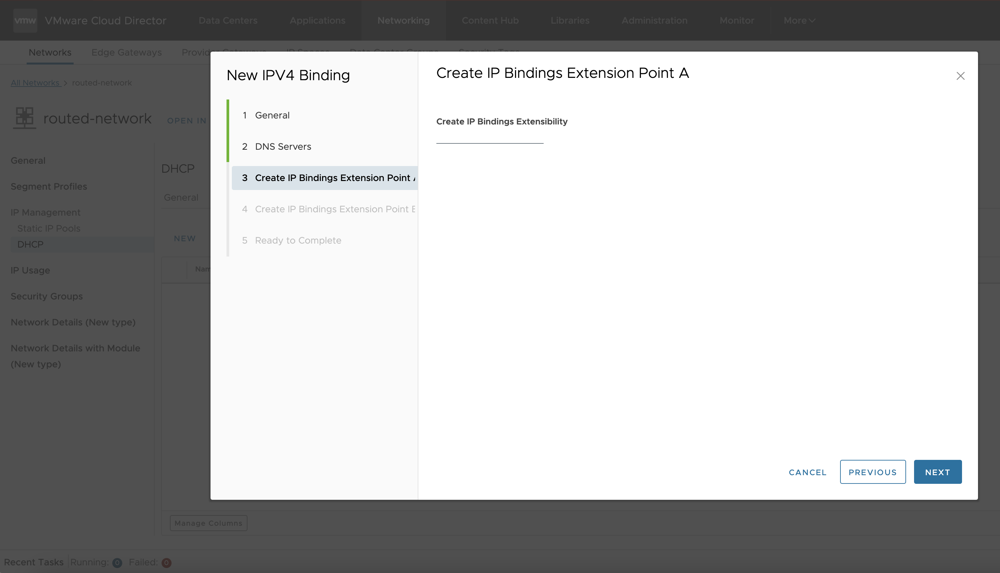
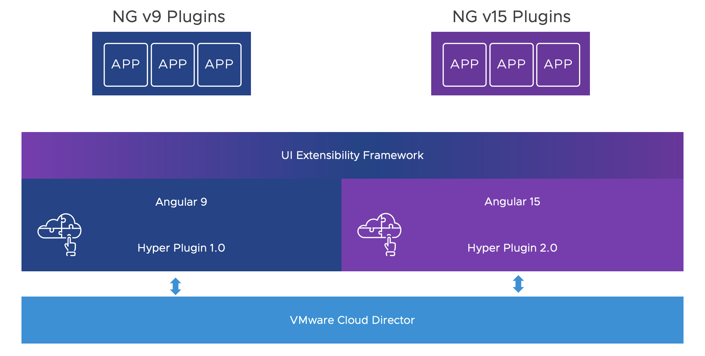

# UI Plugins

The UI plugins are the Could Director UI extensibility mechanism. They are based on Angular and Clarity frameworks.

A UI plugin can be a whole Solution Add-On by itself, or it can be a part of a more complex Solution Add-On, 
which can include different supported elements in itself.
For more information on the elements view [Elements of the Solution Add-Ons](../extension-sdk/elements.md)


## Getting Started

The initial creation of a UI plugin is done in a manner similar to any of the elements of a Solution Add-On. 
For more details on how to create a Solution Add-On, check [Building a Simple Solution Add-On](../extension-sdk/playground.md).

The [Cloud Director Extension Standard Library](https://github.com/vmware/cloud-director-extension-standard-library) repository contains template for creating solution add-ons. 
The Showcase UI plugin is part of the Skeleton template. It contains example utilization of all UI Extension points described below in the development guide. 
To kick-start your UI Plugin development, please refer to the [Generate add-on from template](../extension-sdk/playground.md#create-and-test-solution-add-on-from-template-in-1-minute).

Prerequisites:

- [Setup vcd-ext-shell](../extension-sdk/setup.md#setting-up-the-development-environment)
- [Node.js v14.20](https://nodejs.org)


## UI Plugin Metadata - manifest.json

The manifest.json file contains some basic metadata about the UI plugin (extension), such as name, urn, version, 
and also description of the extension points hooks and their corresponding plugin components and/or modules.

The following mandatory properties are available for configuration in the UI plugin manifest json file:

- urn - unique URN-style identifier of the UI plugin
- name - name of the UI plugin
- description - description of the UI plugin
- manifestVersion - supported version of the manifest file
- containerVersion - the minimum supported version of Cloud Director required for this plugin
- productVersions - list of the Cloud Director versions on which this UI plugin claims compatibility with.
- version - the current version of the UI plugin
- scope - list of the supported scope in which the UI plugin can be published. Currently valid values are: "service-provider", "tenant"
- vendor - the name of the vendor providing the UI plugin
- license - license of the UI plugin: full name, license text, SPDX identifier, or other representation
- link - href to information about the UI plugin
- module - the name of the main exported Angular module of the UI plugin to be loaded dynamically by the Cloud Director
- route - a top level URL route that the module can use to register child routes under
- extensionPoints - see [Extension Points](#extension-points)
- locales - see [Localization](#localization)


Example manifest.json:

```json
{
    "urn": "vmware:vcloud:plugin:demo",
    "name": "Demo plugin 2.0",
    "manifestVersion": "3.0.0",
    "containerVersion": "9.5.0",
    "productVersions": ["10.5"],
    "version": "2.0.0",
    "scope": ["service-provider", "tenant"],
    "permissions": [],
    "description": "An example UI plugin",
    "vendor": "VMware",
    "license": "BSD-2-Clause",
    "link": "http://www.vmware.com/support",
    "module": "DemoModule",
    "route": "demoPlugin",
    "extensionPoints": [{
        "urn": "vmware:vcloud:vm-action:backup-demo",
        "type": "vm-action",
        "name": "%nav.label.vm.backup.action%",
        "description": "%nav.description.vm.backup.action%",
        "component": "VmBackupActionComponent"
    }],
    "locales": {
        "en": {
            "nav.label.vm.backup.action": "VM Backup Action Demo",
            "nav.description.vm.backup.action": "Example of adding an action to VMs"
        }
    }
}
```

## Extension Points

An extension point essentially is a Cloud Director UI predefined placeholder in the primary or contextual navigation, 
in an actions menu, or in a wizard/dialog.
A UI plugin will use this point to attach itself to and provide additional functionality.
There is a list of the supported extension points types, available to select from. Currently, this is list is the following:

- Action Extension Points
  - vm-action
  - vapp-action
- Navigation Extension Points (NOTE: to each of these the plugin author can hook either a module or a component)
  - Primary (Top Level) Navigation Extension Points 
    - navigation:primary
  - Sub Navigation Extension Points
    - Main
      - navigation:datacenter:overview
      - navigation:applications
      - navigation:networking
    - Side Navigation
      - navigation:datacenter:compute
      - navigation:datacenter:network
      - navigation:datacenter:storage
      - navigation:network-details
- Dialog/Wizard Extension Points
  - create-vm
  - create-vapp
  - create-org
  - create-ip-bindings

### Configuring Extension Points in a UI Plugin

The configuration of extension points happens in the manifest.json file. 
To configure an extension point use the following mandatory properties:

- `urn` (mandatory) - must be a unique identifier for each extension point
- `type` (mandatory) - used for defining the particular extension point type
- `name` (mandatory) - name of the extension point
- `description` (mandatory) - description of the extension point
- `component` (mandatory in case the plugin hooks a component) - an Angular component which will be injected for the particular extension point
- `module` (mandatory in case the plugin hooks a module) - an Angular module which will be injected for the particular extension point
- `route` (use for navigation extension points) - a route segment which will be used for the injected module 
  - NOTE: route can be used only when a module has been defined
- `render` (use for dialog/wizard extension points) - define where the plugin component will be rendered.
  - `after` - to render after a specific element, please supply a selector such as .vm-description
  - NOTE: it works only for dialog/wizard extension points. 

NOTE: A UI plugin can be a single Angular component for simple solutions, or an angular module for more complex UI functionality.
You can’t define both component and module for a UI plugin.

If a module attribute has been defined in the manifest, then the specified angular module will be loaded for the UI plugin:

```shell
manifest.json 
    "extensionPoints": [{
        "urn": "urn:vmware:vcd:component-scope:applications:applications-module",
        "type": "navigation:applications",
        "name": "Application Extension Point with Module",
        "description": "Display whole plugin module under the Applications Tab",
        "component": "AppsMainNavExtComponent",
        "module": "AppsMainNavExtModule",
        "route": "applications-plugin"
    }]
```

Every angular component that is an extension point has to be exported from the UI plugin module:

``` demo-plugin.module.ts
export { VmBackupActionComponent } from "./demo-actions";
```

### Action Extensions

The action extension points are used for adding an action or an action group to the actions 
that can be performed on an entity (e.g. VM, VApp, etc).

```shell
manifest.json
    "extensionPoints": [{
        "urn": "vmware:vcloud:vm-action:backup",
        "type": "vm-action",
        "name": "%nav.label.vm.backup.action%",
        "description": "%nav.description.vm.backup.action%",
        "component": "VmBackupActionComponent"
    },
    {
        "urn": "vmware:vcloud:vapp-action:restore",
        "type": "vapp-action",
        "name": "vApp Restore Action",
        "description": "Example of adding an action to vApps",
        "component": "VappRestoreActionComponent"
    }]"
 ```



### Navigation Extensions

The navigation extension points are placeholders in the navigation system of the Cloud Director UI.

#### Primary (Top Level) Navigation Extensions

The primary navigation extensions are rendered at the top level navigation under the More menu.
They are also accessible using the angular routing mechanism, by providing route for the plugin in the plugin's manifest.

```shell
manifest.json
    "extensionPoints": [{
        "urn": "urn:vmware:vcd:component-scope:primary-navigation",
        "type": "navigation:primary",
        "name": "%nav.label.primary.navigation%",
        "description": "%nav.description.primary.navigation%",
        "module": "PrimaryNavModule",
        "route": "primary-plugin"
    },
    {
        "urn": "urn:vmware:vcd:component-scope:simple-navigation",
        "type": "navigation:primary",
        "name": "%nav.label.primary.simple.navigation%",
        "description": "%nav.description.primary.simple.navigation%",
        "module": "SimpleNavModule",
        "route": "primary-simple-plugin"
    }]"
```



#### Sub Navigation Entity Extensions

The sub-navigation extensions are rendered as part of the secondary navigation systems in the Cloud Director UI - 
the side navigation or the main navigation bar.

```shell
manifest.json - Main Navigation extensions: Datacenter Overview
    "extensionPoints": [{
        "urn": "urn:vmware:vcd:component-scope:datacenters",
        "type": "navigation:datacenter:overview",
        "name": "Custom Datacenters",
        "description": "Display custom information in the Datacenter Overview",
        "component": "CustomDatacentersComponent"
    }]"
```

```shell
manifest.json - Main Navigation extensions: Applications view
    "extensionPoints": [{
        "urn": "urn:vmware:vcd:component-scope:applications",
        "type": "navigation:applications",
        "name": "Custom Applications",
        "description": "Display custom information in the Application Tab",
        "component": "CustomApplicationsComponent"
    }]"
```


```shell
manifest.json - Main Navigation extensions: Networking view
    "extensionPoints": [{
        "urn": "urn:vmware:vcd:component-scope:networking",
        "type": "navigation:networking",
        "name": "Custom Netwroking",
        "description": "Display custom information in the Networking Tab",
        "component": "CustomNetworkingComponent"
    }]"
```


```shell
manifest.json - Side Navigation extensions: Datacenter Compute/Network/Storage view
    "extensionPoints": [{
        "urn": "urn:vmware:vcd:component-scope:datacenter-compute",
        "type": "navigation:datacenter:compute",
        "name": "Datacenter Custom Compute",
        "description": "Display custom information in the Datacenter -> Compute section",
        "component": "DatacenterCustomComputeComponent"
    },
    {
        "urn": "urn:vmware:vcd:component-scope:datacenter-network",
        "type": "navigation:datacenter:network",
        "name": "Datacenter Custom Networks",
        "description": "Display custom information in the Datacenter -> Network section",
        "component": "DatacenterCustomNetworksComponent"
    },
    {
        "urn": "urn:vmware:vcd:component-scope:datacenter-storage",
        "type": "navigation:datacenter:storage",
        "name": "Datacenter Custom Storage",
        "description": "Display custom information in the Datacenter -> Storage section",
        "component": "DatacenterCustomStorageComponent"
    }]"
```


```shell
manifest.json - Side Navigation extensions: Network Details
    "extensionPoints": [{
        "urn": "urn:vmware:vcd:component-scope:datacenter-compute",
        "type": "navigation:network-details",
        "name": "Datacenter Custom Compute",
        "description": "Display custom information in the Datacenter -> Compute section",
        "component": "DatacenterCustomComputeComponent"
    }]"
```


Every extension point component in the context of given object, e.g datacenter, can receive the id of that context object by implementing `EntityContextExtensionInterface` interface.
```typescript
@Component({...})
export class DatacenterCustomNetworksComponent implements EntityContextExtensionInterface {
    contextEntityId: string;

    contextUrn(entityId: string) {
        this.contextEntityId = entityId;
    }
}
```

### Dialog/Wizard Extensions

There are UI extension points to support the addition of functionality to dialogs and wizards.

```shell
manifest.json
    "extensionPoints": [{
        "urn": "vmware:vcloud:vapp:create",
        "type": "create-vapp",
        "name": "vApp Create Extension Point",
        "description": "Example of vApp Create Extensibility",
        "component": "VappCreateExtensionPointComponent",
        "render": {
            "after": ".vapp-name-extension-point"
        }
    },
    {
        "urn": "vmware:vcloud:vm:create",
        "type": "create-vm",
        "name": "VM Create Extension Point",
        "description": "Example of VM Create Extensibility",
        "component": "VmCreateExtensionPointComponent",
        "render": {
            "after": ".vm-description"
        }
    },
    {
        "urn": "vmware:vcloud:org:create",
        "type": "create-org",
        "name": "Create Organization Extension Point",
        "description": "Example of Org Create Extensibility",
        "component": "OrgCreateExtensionPointComponent",
        "render": {
            "after": ".description"
        }
    }
```

```shell
manifest.json
    "extensionPoints": [{
        "urn": "vmware:vcloud:ip-bindings:create",
        "type": "create-ip-bindings",
        "name": "Create IP Bindings Extension Point",
        "description": "Example of Create IP Bindings Extensibility located in tenant portal under Network details with activated DHCP",
        "component": "CreateIPBindingsExtensionPointComponent",
        "render": {
            "after": ".dns-servers"
        }
    }]"
```


#### Dialog/Wizard Extensions utilities
`create-org` extension point allows the plugin author to stop Organization creation in the UI if certain validation hasn't passed.
```typescript
@Component({...})
export class OrgCreateExtensionPointComponent extends WizardExtensionWithValidationComponent {
    /**
     * Returns extension point validation state
     */
    getState(): Observable<WizardExtensionState> {
        return of({ isValid: true; });
    };
}
```

A plugin utilizing the `create-ip-bindings` extension point and extending WizardExtensionWithContextComponent will receive the id of the network, in whose context it is rendered.
Having its id, the plugin creator can perform operations on the network.
```typescript
@Component({...})
export class CreateIPBindingsExtensionPointComponent extends WizardExtensionWithContextComponent {
    networkId: string;
    /**
     * Set current network id
     */
    onContext(context: string): void {
        this.networkId = context;
    }
}
```

## UI SDK

The UI Plugin SDK provides means for creating Cloud Director UI plugins.
The UI SDK is available on npm [vcd/sdk](https://www.npmjs.com/package/@vcd/sdk).
Please, note it is separate from the Cloud Director Extension SDK.

### Prerequisites ###

It is recommended for the UI plugin developers to be familiar with Angular (including modules, component resolution 
and dependency injection),  and have the appropriate tooling installed.

### Bootstrapping the SDK ###

`VcdSdkModule.forRoot()` accepts optinal `{apiVersion: "api_version"}`, if set that API version will be used for all 
API calls, if not latest API version for the current VCD instance will be set.

```
@NgModule({
    imports: [
        ...
        VcdSdkModule.forRoot(),
    ],
    declarations: [],
    exports: [],
    providers: []
})
export class MyPluginModule {...}
```

### Angular Injection Tokens

- `AuthTokenHolderService` - get current session auth token from VCD
- `API_ROOT_URL` - root url for the API calls
- `SESSION_SCOPE` - tenant or provider login
- `SESSION_ORGANIZATION` - the name of the org you are logged in
- `SESSION_ORG_ID` - the id of the org you are logged in
- `EXTENSION_ASSET_URL` - URL to folder where the static assets of the plugin are located.
- `extensionRoute` - relative to the Cloud Director application route, in which the plugin is registered. This corresponds to the "route" attribute set in the manifest.json of the plugin.

```
manifest.json
{
    "urn": "vmware:vcloud:plugin:demo",
    "name": "Demo plugin",
    "manifestVersion": "3.0.0",
    "containerVersion": "9.5.0",
    "productVersions": ["10.5"],
    "version": "2.0.0",
    "scope": ["service-provider", "tenant"],
    "permissions": [],
    "description": "Demonstrates Cloud Director UI plugin",
    "vendor": "VMware Inc",
    "license": "BSD-2-Clause",
    "link": "https://www.vmware.com/support",
    "module": "DemoPluginModule",
    "route": "demoPlugin",
    "extensionPoints": [...],
    "locales": {
        "en": {...},
        "de": {...},
        "fr": {...},
        ...
    }
```

#### Handling conditional logic based on the scope (provider or tenant)

The `SESSION_SCOPE` token has to be injected in the handling component to be able to differentiate behavior based 
on the current scope - tenant or provider.

scope-example.component.ts
```typescript
@Component({
    selector: "scope-example",
    templateUrl: "scope-example.component.html",
    styleUrls: ['scope-example.component.scss']
})
export class ScopeExampleComponent {
    constructor(@Inject(SESSION_SCOPE) public scope: string) {
    }
}
```

scope-example.component.html
```html
<h1 class="title">My current scope is: {{ scope }}</h1>
<div *ngIf="scope === 'tenant'">Hello tenant!</div>
<div *ngIf="scope === 'service-provider'">Hello service provider!</div>
```

#### Fetching static resources in UI Plugins

Injection of the EXTENSION_ASSET_URL is required for the plugin to correctly locate any assets that are contained in it, 
as shown in the example `` tag below.  
The assets for each plugin are loaded from the server in isolation from any other plugins, 
and in isolation from the Cloud Director instance itself.
The root URL for loading static resources is defined by the Cloud Director and needs to be injected in the component 
for the latter to be able to fetch static resources.

load-static-image-demo.component.ts
```typescript
@Component({
    selector: "load-static-image-example",
    templateUrl: "load-static-image-example.component.html",
    styleUrls: ['load-static-image-example.component.scss']
})
export class LoadStaticImageExampleComponent {
    constructor(@Inject(EXTENSION_ASSET_URL) public assetUrl: string) {
    }
}
```

load-static-image-example.component.html
```html
<h1 class="title">{{"title" | translate}}</h1>

<p class="paragraph1">{{"paragraph1" | translate}}</p>
<p class="paragraph2">{{"paragraph2" | translate}}</p>


```

### Cloud Director API Client

The VcdApiClient provides basic means for interacting with the Cloud Director APIs. 
The client uses the authorization performed in the Cloud Director instance, the plugin is running within, 
so in general there is no need for explicit authentication/login.
This client provides CRUD methods, paginated queries, tasks tracking, to perform on Cloud Director entities,
means to upload files to the Cloud Director instance, HATEOS links handling, session and multisite information.
The request headers links and etag are intercepted and moved to links and etag in the response body.
Logging interception is also available.

```
export class SimpleComponent implements OnInit {
    username: Observable<string>;
    tenant: Observable<string>;

    constructor(private client: VcdApiClient) {}

    ngOnInit(): void {
        this.tenant = this.client.organization;
        this.username = this.client.username
        
        this.client.query(Query.Builder.ofType("organization").links(false)).subscribe(results => {
            console.log(results);
        });
    }
}
```
#### API Version
By default latest API version will be used by the VcdApiClient. Using VcdApiClient or VcdSdkModule you can set desired API version manually by:
```typescript
constructor(private client: VcdApiClient) {
    this.client.setVersion("39.0");
}
```
```typescript
@NgModule({
    imports: [
        ...
        VcdSdkModule.forRoot({
            apiVersion: "39.0"
        }),
    ],
    declarations: [],
    exports: [],
    providers: []
})
export class MyModuleModule {...}
```
#### C R U D
VcdApiClient supports the following CRUD operations:
```typescript
// Create
this.client.createSync("api/endpoint", body, options);
// Read
this.client.get("api/endpoint", options);
// Update
this.client.updateSync("api/endpoint", body, options);
// Delete
this.client.deleteSync("api/endpoint", options);
```
Every method from the aforementioned list supports Async alternative of the method, where Async means that you work with Task, i.e long running operation, in Cloud Director.

You get some ancillary methods as well like:
```typescript
// Get list of objects from given type
const query = Query.Builder.ofType("objectType");
// Fetch the actual list
const records = this.client.query(query);

// Operations that manipulate the response from the query
this.client.firstPage(records);
this.client.hasFirstPage(records);
this.client.lastPage(records);
this.client.hasLastPage(records);
this.client.nextPage(records);
this.client.hasNextPage(records);
this.client.previousPage(records);
this.client.hasPreviousPage(records);
```
#### TransferService - Upload Large Files
In Cloud Director you would need to upload large files. To handle this process you can use the TransferService provided by @vcd/sdk.
```typescript
const fileToUpload = null;
const uploadingProgress = new Subject<TransferProgress>();

this.client.startTransfer(`api/upload/file`, body).pipe(
    flatMap((transferClient) => {
        return transferClient.upload(fileToUpload, uploadingProgress)
    })
);
```

#### Check permissions
Usugin the VcdApiClient you can check if the user has permissions to perform a given operation by:
```typescript
const canEditRecord = this.client.canPerformAction(record, "edit");
```
Where `canPerformAction` actually checks if a given Link is present in the body of the `record` with `edit`. The rel encodes the type of operation to be executed on that resource.

You can find more information about the Links in [VMware Cloud Director OpenAPI](https://developer.vmware.com/apis/vmware-cloud-director/latest/).

#### Act-As
Act-As is an HTTP Header that you can use to perform API requests in the context of given Organization.
```typescript
this.client.get("api/endpoint", {
    headers: new HttpHeaders({
        "X-VMWARE-VCLOUD-TENANT-CONTEXT": "orgId"
    })
});
```

## UI Builder

UI builder facilitates the building of an angular app as an [AMD](https://en.wikipedia.org/wiki/Asynchronous_module_definition).
The UI Builder can be utilized from npm [vcd/plugin-builders](https://www.npmjs.com/package/@vcd/plugin-builders).

### Configuration

The configuration for the generation of the final plugin build is done using the angular.json file located under projects/uiPlugin/architect/build.

```json
{
    "build": {
        "builder": "@vcd/plugin-builders:plugin-builder",
        "options": {
            "modulePath": "src/main/my-plugin.module.ts#MyPluginModule",
            "outputPath": "dist/",
            "index": "src/index.html",
            "main": "src/plugin.main.ts",
            "tsConfig": "tsconfig.json",
            "assets": [{
                "glob": "**/*",
                "input": "./src/public",
                "output": "/"
            }],
            "optimization": false,
            "outputHashing": "all",
            "sourceMap": false,
            "extractCss": false,
            "namedChunks": false,
            "aot": false,
            "extractLicenses": false,
            "vendorChunk": false,
            "buildOptimizer": false
        }
    }
}
```

Note the two differences to the standard angular builder configuration:

- `modulePath` - this points to the main module of the plugin.
- `assets` folder must always be specified.


The `externalLibs` configuration represents the list of the libraries which are expected to be provided 
by the Cloud Director Core UI and excluded from the current UI plugin build. 
Each library name is a regular expression formatted as a string.

```shell
{
  "build": {
    "builder": "@vcd/plugin-builders:plugin-builder",
    "options": {
      "externalLibs": [
        "@cds/core"
      ]
    }
  }
}
```

This example configuration will result in the @cds/core being excluded from the UI plugin build 
and the Cloud Director is expected to provide this library for the plugin.

### Build/Run

ng build

## UI Emulator

The UI Emulator uses the Hyper Plugin to simulate the Cloud Director Extensibility Framework in non-production 
environment, for local development.
It can be utilized from npm: [vcd/ui-emulator](https://www.npmjs.com/package/@vcd/ui-emulator).

### Features

- Support for Angular v15 and v9
- Source maps
- Live reload
- Proxy HTTP calls to live Cloud Director environment
- Authentication with JWT or Cloud Director auth token
- Tenant and Provider scoping
- Localization
- Multiple UI Plugins loading
- Emulation of all extension point types

### Installation

Full example can be found in [Cloud Director Extension Standard Library Multi Instance Skeleton](https://github.com/vmware/cloud-director-extension-standard-library/tree/main/add-on/multi-instance-skeleton)

1. Clone [Cloud Director Extension Standard Library Multi Instance Skeleton](https://github.com/vmware/cloud-director-extension-standard-library/tree/main/add-on/multi-instance-skeleton)
```bash
git clone https://github.com/vmware/cloud-director-extension-standard-library.git
```
1. Copy `add-on/multi-instance-skeleton/.ui-emulator` folder next to your UI plugin folder. Note, you can place the UI emulator anywhere in your file system, you must re-configure the path to UI plugins folder (`emulatorConfig.relativePath` and `emulatorConfig.relativePathToUIPlugins`, see Configuration section).
2. Install dependencies of UI Emulator
```bash
cd ./add-on/multi-instance-skeleton/.ui-emulator
npm i
```

### Configuration


- `pluginServeList` - list of directories for the UI plugins that are to be loaded in the emulator
- `vcdHost` - the URL of the Cloud Director instance
- `jwt` - the JSON Web Token (JWT) used for authentication to the Cloud Director API
- `authtoken` - obsolete authentication token to the Cloud Director API (used by older API versions)
- `scope` - set the scope to use: tenant or service-provider
- `orgName` - set the the name of the organization/tenant to be used
- `orgId` - set the ID of the organization/tenant to be used
- `emulatorConfig`
  - `relativePath` - the relative path to the directory of the emulator, the path is relative to current emulator folder.
  - `relativePathToUIPlugins` - the relative path to the directory of the UI plugins, the path is relative to current emulator folder.
  - `watch`: Boolean value that Enable or Disable the watch functionality of the Emulator for all UI plugins that it hosts.
  - `ignoreFilesRegex`: ignore certain files from the Emulator's watch functionality based on regular expressions. Syntax `/your regex/`
  - `devServerArguments` - standard ng serve arguments to be provided in this element
  - `watch` - Enable/Disable watch for file changes in UI plugin folders
  - `ignoreFilesRegex` - Using RegExp ignore given files that match the pattern


The following properties will be provided using angular injection tokens:

- jwt - provided by the AuthTokenHolderService token: `@Inject(AuthTokenHolderService)`
- authtoken - provided by the AuthTokenHolderService token: `@Inject(AuthTokenHolderService)`
- scope - provided by the session scope token: `@Inject(SESSION_SCOPE)`
- orgName - provided by the session organization token: `@Inject(SESSION_ORGANIZATION)`
- orgId - provided by the session organization ID token: `@Inject(SESSION_ORG_ID)`


Sample config.json:

```json
{
    "pluginServeList": [
        "ui"
    ],
    "vcdHost": "https://cloud-director-instance",
    "jwt": "eyJhbGciOiJSUzI1NiJ9...",
    "authtoken": "c14c79...",
    "scope": "service-provider",
    "orgName": "System",
    "orgId": "",
    "emulatorConfig": {
        "watch": true,
        "relativePath": "./../emulator",
        "relativePathToUIPlugins": "./..",
        "ignoreFilesRegex": null,
        "devServerArguments": [
            "--host",
            "0.0.0.0",
            "--port",
            "4200"
        ]
    }
}
```

### Running the Emulator

```shell
npm run start
```

### Proxy Configuration

Emulator uses standard angular proxy mechanism. If you need to re-configure the proxy refer to Angular Documentation.

Sample proxy.conf:
```json
{
    "/api/*": {
        "target": "https://<insert your Cloud Director endpoint here>",
        "secure": false,
        "logLevel": "debug",
        "changeOrigin": true
    },
    "/cloudapi/*": {
        "target": "https://<insert your Cloud Director endpoint here>",
        "secure": false,
        "logLevel": "debug",
        "changeOrigin": true
    }
}
```

## iframe support

UI Plugins can contain iframes.
Please, note that the Cloud Director UI is based on Angular. 
In case you would like to use another UI framework, you may try utilizing iframes.

For iframe usage, typically your approach would be:

 - Create a simple angular-based UI plugin
 - Add a component that hosts the iframe
 - The iframe host component can pass data to the iframe using [Window.postMessage()](https://developer.mozilla.org/en-US/docs/Web/API/Window/postMessage), query params in the iframe URL, etc.

In terms of hosting the iframe contents, there are the following options:

 - Without hosting server - the solution application's build output files can be loaded as assets to a simple angular plugin. 
This way, the Cloud Director will host and serve your solution application files.
You can embed your Application like this:
```html
<iframe src="https://vcd.com/<PROVIDER OR TENANT>/uiPlugins/<PLUGIN_ID>/<RESOURCE_ID>/assets/<YOUR_APPLICATION_INDEX_HTML>"></iframe>
```
Note: Here the iframe source url is the EXTENSION_ASSET_URL injection token value.

 - Using host server - deploy your application to host server and embed the iframe in a simple angular UI plugin.

## Localization

### Extension Name and Description Localization

The Localization for the extension point name and description is done within the manifest.json.
To localize you can use placeholders in the format "%translation.key%, which you map to translations in the locales sections.

```
manifest.json
{
    ...
    "extensionPoints": [...]",
    "locales": {
        "en": {
            "nav.label.primary.navigation": "Primary Navigation Extension Point",
            "nav.description.primary.navigation": "Primary navigation plugin example",
            "nav.label.primary.simple.navigation": "Simple Plugin",
            "nav.description.primary.simple.navigation": "Simple plugin example"
        },
        "de": {
            "nav.label.primary.navigation": "Primärer Navigationserweiterungspunkt",
            "nav.description.primary.navigation": "Beispiel für ein primäres Navigations-Plugin",
            "nav.label.primary.simple.navigation": "Einfaches Plugin",
            "nav.description.primary.simple.navigation": "Einfaches plugin-beispiel"
        },
        "fr": {
            ...
        }
        ...
    }
}
```

### UI Plugin Content Localization

The localization for the plugin content is done using the [vcd/i18n](https://www.npmjs.com/package/@vcd/i18n).

The Cloud Director translation service supports 2 localization file formats, from which you can choose:

  - one file (i18n.json) with all the locales (default)
```
public/i18n.json
{
    "en": {
        "simple.title": "Simple Plugin Example",
        "simple.login.info": "Logged in as {0}",
        "tos.title": "Terms of Service",
        ...
     },
     "de": {
       "simple.title": "Einfaches Plugin-Beispiel",
        "simple.login.info": "Angemeldet als {0}",
        "tos.title": "Nutzungsbedingungen",
        ...
     },
     "fr": {
       ...
     },
     ...
}
```
- separate file for each locale, e.g. en.json, fr.json, de.json, etc.


## Toggling source maps

The toggling of the source maps is done through [Angular configuration](https://angular.io/guide/workspace-config#source-map-configuration).

example angular.json of your UI plugin:
```json
{
  "build": {
    "options": {
      "sourceMap": true,
      "optimization": false,
    }
  }
}
```

## Clarity Icons

[Clarity icons](https://core.clarity.design/foundation/icons/) are provided by the Cloud Director, 
there are no additional actions required by the plugin developer in order to utilize them.

Examples:

clarity-cds-icon-example.component.html
```html
<cds-icon shape="info-circle" size="20" status="info"></cds-icon>
```

clarity-clr-icon-example.component.html
```html
<clr-icon shape="user" size="16"></clr-icon>
```

## Under the Hood

The UI plugins are deployed using the Cloud Director UI HyperPlugin.

Currently, we support concurrently two versions of the Hyper Plugin in order to be able to run 
Angular v9 and Angular v15 plugins together on a single Cloud Director UI.




## Cloud Director Releases, Angular and Clarity


| Releases                  | Cloud Director 10.5.x | Cloud Director 10.4.x | Cloud Director 10.3.x |
|---------------------------|-----------------------|-----------------------|-----------------------|
| Angular v15 / Clarity v15 | yes                   | -                     | -                     |
| Angular v9 / Clarity v3   | yes                   | yes                   | yes                   |


[See Clarity Support Policies](https://clarity.design/documentation/support)

IMPORTANT: With the next major release of Cloud Director after 10.5, we will be dropping support for Angular v9.

## Migration from Angular v9 to Angular v15
### Step 1 - Update dependencies
Go to `./packages/uiPlugin/package.json` and change NPM dependencies to
```json
{
    "scripts": {
        "build": "ng build",
    },
    "dependencies": {
    "@angular/animations": "15.2.0",
    "@angular/common": "15.2.0",
    "@angular/compiler": "15.2.0",
    "@angular/core": "15.2.0",
    "@angular/forms": "15.2.0",
    "@angular/platform-browser": "15.2.0",
    "@angular/platform-browser-dynamic": "15.2.0",
    "@angular/router": "15.2.0",
    "@cds/core": "6.3.1",
    "@clr/angular": "15.0.3",
    "@clr/ui": "15.0.3",
    "@ngrx/store": "10.1.2",
    "@vcd/bindings": "9.1.1",
    "@vcd/i18n": "12.0.0",
    "@vcd/plugin-builders": "15.0.2",
    "@vcd/sdk": "15.0.4",
    "rxjs": "7.8.0",
    "tslib": "2.3.0",
    "zone.js": "0.12.0"
  },
  "devDependencies": {
    "@angular/cli": "15.2.3",
    "typescript": "4.9.4"
  }
}
```

### Step 2 - Update usages of VcdSdkModule
Search in your project for usages of `VcdSdkModule` and replace it with `VcdSdkModule.forRoot()`;

### Step 3 - Remove all usages of PluginModule
Search in your project for usages of `export class MyPluginModule extends PluginModule {...}` and remove `extends PluginModule` part.

### Step 4 - Update your manifest.json
Open your `packages/uiPlugin/src/public/manifest.json` file and add `"manifestVersion": "3.0.0",`.
Your `manifest.json` should look like this now
```
{
    "urn": "vmware:vcloud:my:plugin",
    "name": "My Plugin",
    "manifestVersion": "3.0.0",
    ...
    ..
    .
}
```
### Step 5 - Build
```
cd ./packages/uiPlugin
npm run build
```

## Troubleshooting

### A bundle is missing in the final plugin build.

When the plugin is configured to expect a bundle to be loaded for it by the Cloud Director, e.g. @angular/testing, 
but the Cloud Director cannot provide it, then an error like the one below will be shown:

```console
Could not load bundle SyntaxError: Unexpected token '<' at (bundle.js:...

Could not load module(s) TypeError: Cannot read properties of null (reading 'MyExamplePluginModule')...
```

### Attempting to register already registered web components

In case the plugin creator has forgotten to exclude the cds/core from the build [UI Builder](#configuration),
then an error like the one below will be shown:

```console
[HyperPlugin] Bundle of plugin with urn string:string:.. failed to load! Error: execute 'define' on 
'CustomElementRegistry': the name "clr-icon" has already been used with this registry

Error: Failed to execute 'define' on 'CustomElementRegistry': the name "clr-icon" has already been used with this registry
```

### Plugin is not published or uploaded

In case your plugin is not visible in the Cloud Director UI and there are not any errors logged in the browser console,
check if you have uploaded and published it or try to redo the upload and publishing steps.
